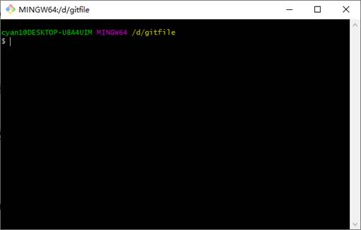
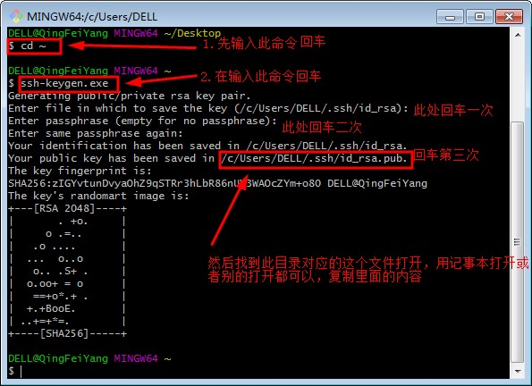
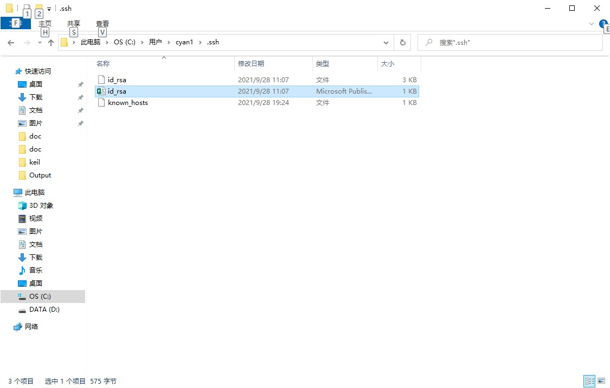
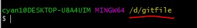
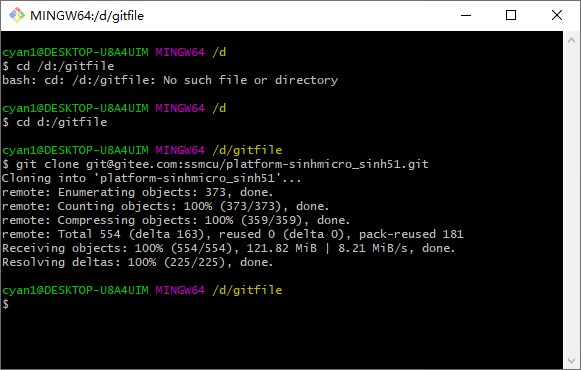
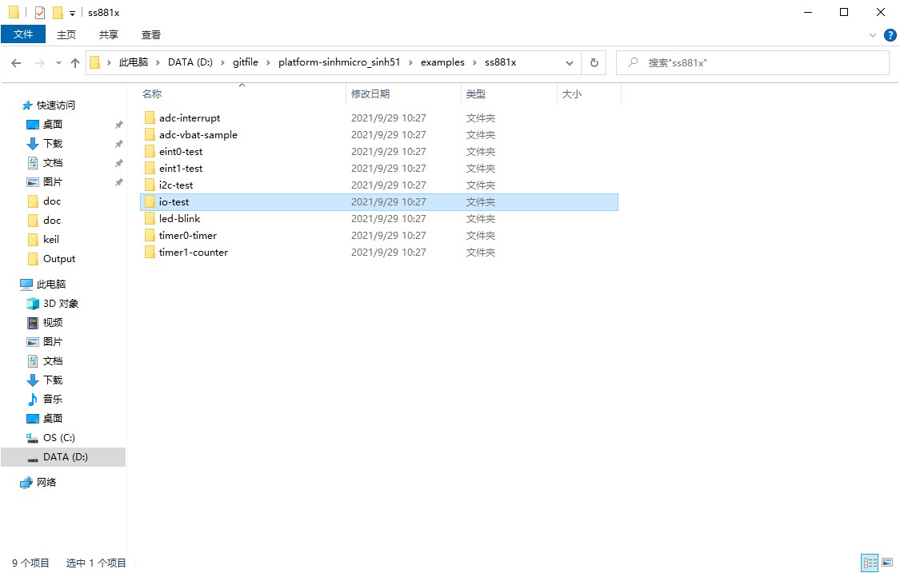
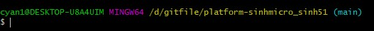
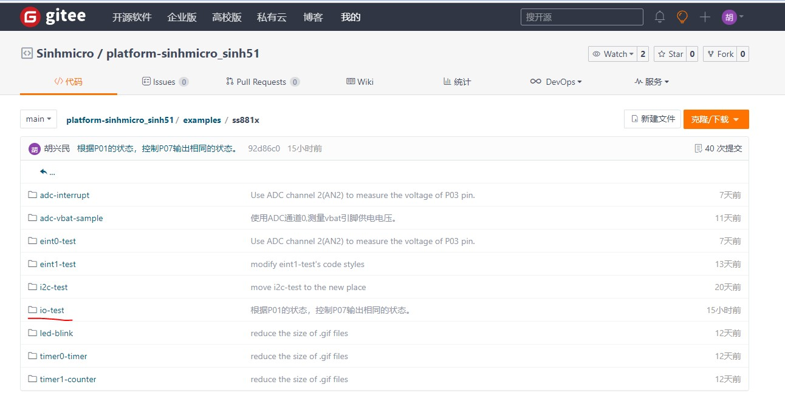

## 1. 去gitee上申请账号

1. 去https://gitee.com/网上自行注册。

## 2. 在本地下载git for windows客户端

1. 也可自行去管网下载：https://git-scm.com/downloads

## 3. 一些简单的配置（如要是自己的用户名、邮箱之类的信息）

1) 安装完成后，在D盘新建文件夹，例如：gitfile

2) 进入gitfile文件夹中，鼠标点右键，打开Git Bash Here如下：

3) 在窗口中输入git config --global user.name "username"

   然后回车设置你的用户名（username换成你的名字拼音）。

4) 在窗口中输入git config --global user.email "153@qq.com"

   然后回车设置你的邮箱（153@qq.com换成你的邮箱）。

**注意：此用户名和邮箱是git提交代码时用来显示你身份和联系方式的，可以随便设置，并不是github用户名和邮箱，但是为了好识别是你提交的代码，所以名字就设置成你姓名拼音，邮箱设置你使用的邮箱就行了。**

## 4. 在本地用命令行生成git的公匙（给到项目的管理员）

1) 输入命令：cd ~

2) 然后输入：ssh-keygen.exe

3) 然后按回车，再次按回车，在回车，按三次回车：

4) 在C:\Users\cyan1\.ssh（注意：cyan1是你的电脑名字，不同的人不一样）下找到id_rsa文件（后缀为.pub，有的电脑不显示后缀），如下图所示，将此文件发送给项目的管理员。

## 5. 项目管理员在项目后台加入git公匙。开通上传权限

1) 等权限开通后进行后面操作

## 6. 使用命令行git clone导入代码

1. 关闭Git Bash Here，并在gitfile文件夹中右键重新打开Git Bash Here，确认文件路径在你的gitfile文件（你也可以用“cd filepath”命令到你的gitfile中，但为了不出错，你可以直接在你设置的gitfile文件夹中重新打开Git Bash Here）。

   ​							  									 

2. 输入git clone [git@gitee.com:ssmcu/platformsinhmicro_sinh51.git](mailto:git@gitee.com:ssmcu/platformsinhmicro_sinh51.git)

​		将会把远程仓库的文件拉到你的gitfile中，此时你的gitfile文件下会多出一个名为platform-sinhmicro_sinh51的文件夹，操作如下图：

## 7. 将自己的改动合并到导入的代码中

1. 将你的代码文件夹放到下面路径中，如下图中的io-test就是我要上传的文件夹。并将io-test中的临时文件删除（obj、lst等编译生成的临时文件不能上传）。

   D:\gitfile\platform- sinhmicro_sinh51\examples\ss881x

## 8. 使用git add/git commit将改动上传倒本地仓库

1. 关闭Git Bash Here，并在D:\gitfile\platform-sinhmicro_sinh51文件夹中右键重新打开Git Bash Here，确认文件路径在platform-sinhmicro_sinh51文件下。

2. 输入git add .（注意后面的点不能缺少，它的意思是把platform-sinhmicro_sinh51文件下东西都上传进去）。

3. 输入 git commit –m”添加备注”（后面的添加备注可以是你上传文件的功能介绍）。

## 9. 使用git push将改动上传到远端仓库

1. 输入git push origin将改动上传到远端仓库。

2. 登陆https://gitee.com/ssmcu/platform-sinhmicro_sinh51/tree/main/examples/ss881x 查看你的文件是否上传成功。

