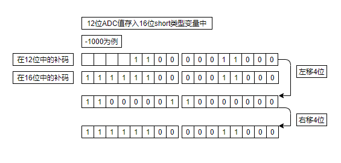
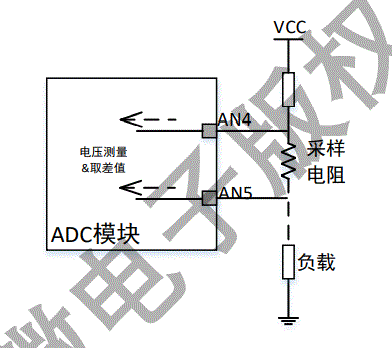
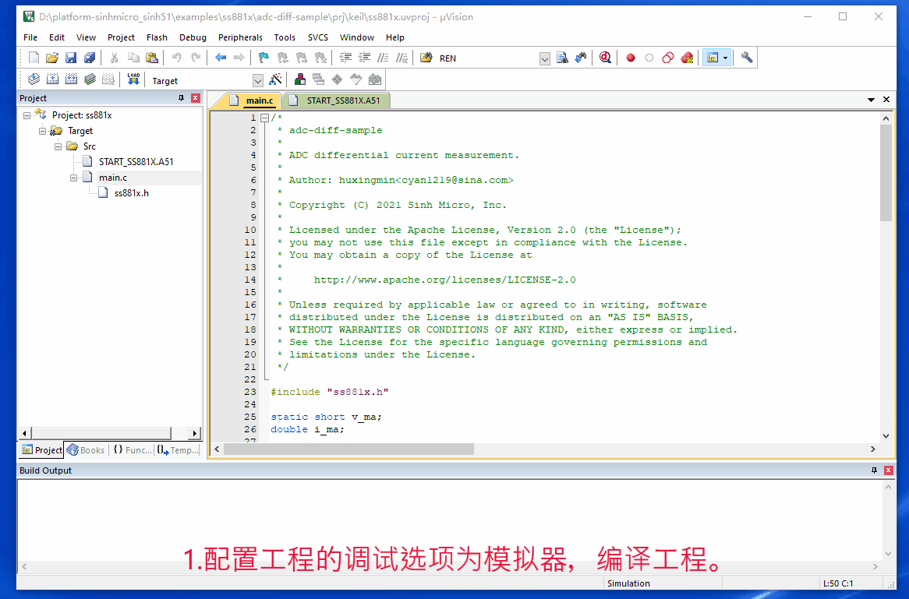
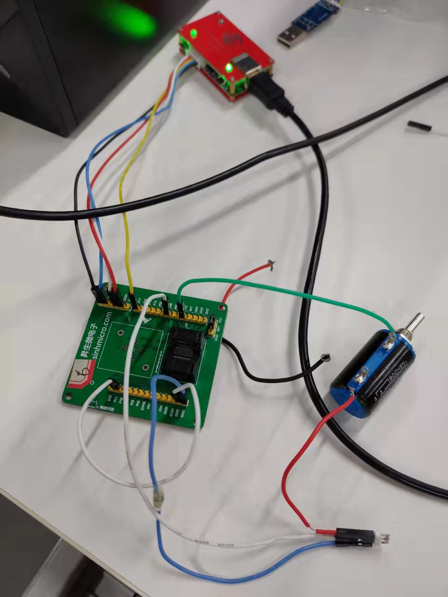
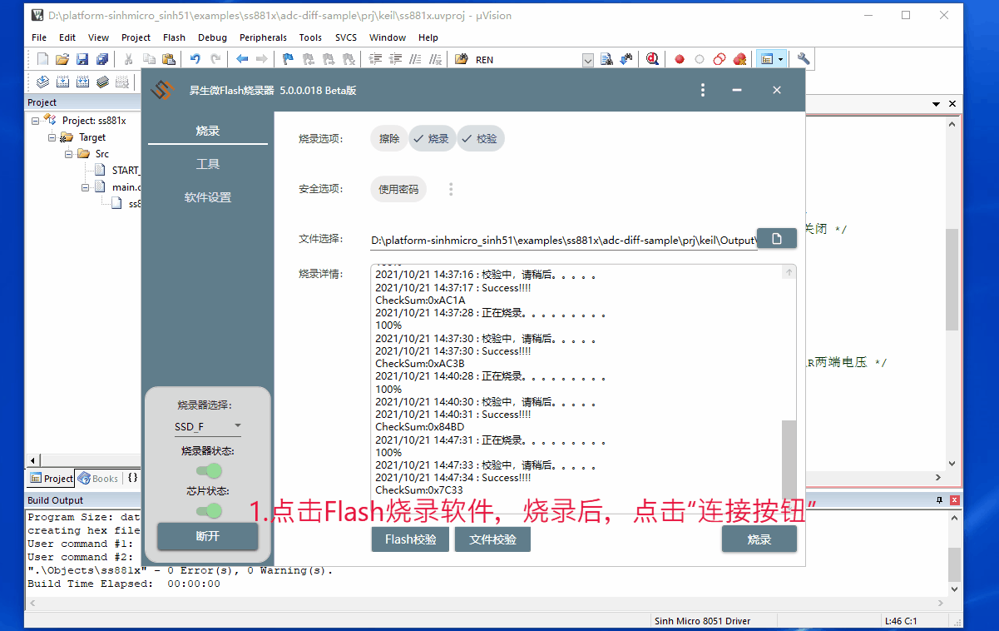

# 1. 功能说明
​		ADC差分电流测量。

# 2. 功能实现

1. 配置MFP1寄存器和MFP2寄存器，使P06作为AN4（此时与烧录器连接时用P17作DAT线，并且在烧录器上点连接按钮时，将P06用线接GND，连接成功后P06可以不再接GND，可以将P06作为AN4线与外电路连接），P11作为AN5。

2. 配置CLKCON1寄存器，使ADC模块系统时钟使能；配置ADCCON0寄存器，使采样时钟频率（**Fclk**）为2MHZ，滤波（**L**）512级；配置ADCCHEN寄存器，使AN4,AN5通道开启（通道数为**C**），其它通道关闭。根据以下公式得到采样速率（Sample Rate）为108 SPS。 
$$
  Sample Rate = Fclk/18/C/L
$$

3. 配置ADCCON2寄存器，使能差分模式。当工作在差分模式时，根据以下公式得到AN4端口与AN5端口电压之差。
$$
v(ma) = V(AN4) - V(AN5) = ADCVAL/增益放大倍数
$$
  **注意：单位：mV。**

  ​			**增益放大倍数默认36，可通过ADCCON3和ADCCON4寄存器的GAIN0和GAIN1配置。**

  ​			**由于2^11 / 36 = 56，所以采样的电压范围为-56mV ~ +56mV。**

4. 取出ADC的值（ADCVAL），即可求出 v (ma) 。

  将12位补码转换成16位补码，可参考以下图片理解

5. 模拟器上调试方式

  模拟器上不支持测电流，所以先模拟测电压。调节AN4端口与AN5端口电压之差，查看 v (ma) 的数据是否正确。

6. 电路板上调试方式

  搭建如下电路，将采样电阻（R）的两端分别接在AN4和AN5端口上。同理，通过下列公式即可求出采样电阻的电流 i(ma)。
$$
i(ma) = v(ma) / R
$$
  

​	本程序选用 R = 100mΩ ，根据下列公式先对 i (ma) 的计算进行简化，从而减小软件计算量。
$$
i(ma) = ADCVAL / 36 / R
$$

$$
i(ma)	 = ADCVAL *1000 / 36 / 100 = ADCVAL * 5 / 18
$$

$$
i(ma) = ( ADCVAL * 4 +ADCVAL) / 2 / 9
$$

$$
i(ma)	 = (((ADCVAL << 2) + ADCVAL) >> 1) / 9;
$$

# 3. 代码编译

## 3.1 PlatformIO IDE

### 3.1.1 参考如下链接，搭建PlatformIO IDE的开发环境

http://www.sinhmicro.com.cn/index.php/more/blog/vscode-platformio-sinh51

### 3.1.2 在PlatformIO IDE中打开工程并编译

和其它示例基本一致，不再详细说明，具体请参考：

[led-blink/doc/readme.md](../../led-blink/doc/readme.md)

## 3.2 Keil C51 IDE

### 3.2.1 参考如下链接，搭建Keil C51 IDE的开发环境

http://www.sinhmicro.com/index.php/tool/software/debugger/sinh51_keil

### 3.2.2 在Keil C51 IDE中打开工程并编译

和其它示例基本一致，不再详细说明，具体请参考：

[led-blink/doc/readme.md](../../led-blink/doc/readme.md)

# 4. 测试步骤

## 4.1 通过模拟器测试
### 4.1.1 PlatformIO IDE

暂不支持。

### 4.1.2 Keil C51 IDE

1. 配置工程的调试选项为模拟器，编译工程。
2. 启动调试，将 i_ma 和 v_ma 添加到WATCH1中，点击运行。
3. 在“Peripherals”标签中打开ADC模拟器。
4. 调节AN4与AN5的值，设置断点使程序停下后，观察 v_ma = V(AN4) - V(AN5) 。

## 4.2 通过开发板测试

### 4.2.1 参考如下链接，进行硬件连接

http://sinhmicro.com/index.php/tool/hardware/debugger/ssd8

1. 将电阻R1与采样电阻R串联起来，并接到VCC与GND之间构成通路。
2. 将采样电阻正极与P06（AN4）连起来，采样电阻负极与P11（AN5）连起来，此时 v_ma 测量采样电阻两端的电压。
3. 使用万用表测得VCC = 3.6V，R1 = 8.9 Ω，R = 100mΩ。从而计算出 v =  v_ma =  40 mV，i_ma = 400 mA。

### 4.2.2 通过Flash_Tools烧录固件

和其它示例基本一致，不再详细说明，具体请参考：

[led-blink/doc/readme.md](../../led-blink/doc/readme.md)

### 4.2.3 硬件调试

1. 使用USB B连接线将调试器与PC连接起来。
2. 点击Flash烧录软件，烧录后，点击 “连接按钮” 对开发板进行供电。
3. 配置工程的调试选项为 Sinh Micro 8051 Diver，在keil C51上点击调试。
4. 将 i_ma 和 v_ma 添加到WATCH1中，点击运行。
5. 点击停止，发现 v_ma = 40，i_ma = 400，与实际相符。

