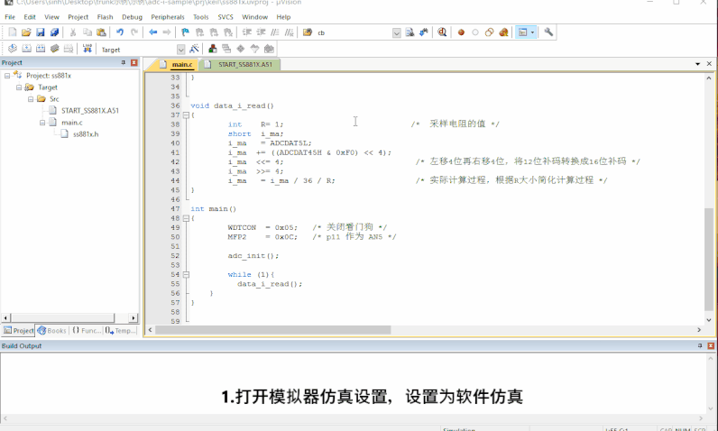

# 1. 功能说明
SS881X利用ADC模块的AN4或AN5工作在微电压模式时，内部使能了12/24/36倍增益放大器，结合外部采样电阻，可单独用作单端电流检测，如下图：

 本例程通过将P11的AN5配置为微电压模式，内部使能了36倍增益放大器，结合外部采样电阻，测量负载的电流。（ADC采样电流实质是通过电阻将电流转换为电压采样）

# 2. 功能实现

1. 关闭看门狗，配置MFP2，P11作为AN5通道；
2. ADC和时钟配置：

（1）配置CLKCON1寄存器，将SCLK给ADC，使能ADC；（必须先使能ADC才能配置其他寄存器）

（2）配置ADCCON0寄存器，定义ADC为连续模式（周期采样），ADC采样时钟1MHz，ADC采样后滤波求均值样本个数128；

（3）配置ADCCHEN寄存器使能AN5通道；

（4）配置ADCCON3，bit1写0，将AN5配置为微电压模式；

3. ADC值的读取：

（1）配置采样电阻的值，本例程负载为1KΩ，采样电阻为1Ω（采样电阻值要远小于负载阻值）

（2）取ADC值，将12位补码转换成16位补码；

（3）ADC测量值和实际电流值的对应关系为：I(mA)=ADCVAL / 36 / R，R为采样电阻，单位mΩ，实际计算过程中，可根据R的大小简化计算过程。

# 3. 代码编译

## 3.1 PlatformIO IDE

和其它例程基本一致，不再详细说明，具体参考：

###### [led-blink/doc/readme.md](../../led-blink/doc/readme.md)

### 3.1.1 参考如下链接，搭建PlatformIO IDE的开发环境

http://www.sinhmicro.com.cn/index.php/more/blog/vscode-platformio-sinh51

### 3.1.2 在PlatformIO IDE中打开工程并编译

和其它例程基本一致，不再详细说明，具体参考：

###### [led-blink/doc/readme.md](../../led-blink/doc/readme.md)

## 3.2 Keil C51 IDE

### 3.2.1 参考如下链接，搭建Keil C51 IDE的开发环境

http://www.sinhmicro.com/index.php/tool/software/debugger/sinh51_keil

### 3.2.2 在Keil C51 IDE中打开工程并编译

和其他例程基本一致，不在详细说明，具体参考：

[led-blink/doc/readme.md](../../led-blink/doc/readme.md)

# 4. 测试步骤

## 4.1 通过模拟器测试
### 4.1.1 PlatformIO IDE

暂不支持。

### 4.1.2 Keil C51 IDE

1. 编译工程。
2. 打开"Option-->Debug"界面。
3. 配置工程的调试选项为模拟器。
4. 启动调试。
5. 运行代码，调试并观察结果，查看i_ma的值与AN5通道是否一致。（由于模拟器软件仿真只有电压测试，因此在模拟器仿真时需要将代码中采样电阻R的值设置为1，相当于微电压采样，得到的值是电压值；而在实际测量电路时，需要根据实际采样电阻值设置代码中的采样电阻R。）

## 4.2 通过开发板测试

### 4.2.1 参考如下链接，进行硬件连接

http://sinhmicro.com/index.php/tool/hardware/debugger/ssd8

### 4.2.2 通过Flash_Tools烧录固件

1. 打开Flash_Tools工具。
2. 点击“连接”按钮。
3. 选择相应的固件,固件位于“Output”目录中。
4. 点击“烧录”按钮，查看烧录状态。

### 4.2.3 硬件调试

实际电路搭配如下图所示：例如本例程，接入5V模拟电池，负载为1KΩ，采样电阻为1Ω，则电路的电流为5mA。

用keil调试时，得到的值为176(如下图)，由 I(mA)=ADCVAL / 36 / R得，I(mA) =176 / 36  / 1 = 4.89mA。（存在一定误差且误差在一定范围内，说明没问题）

