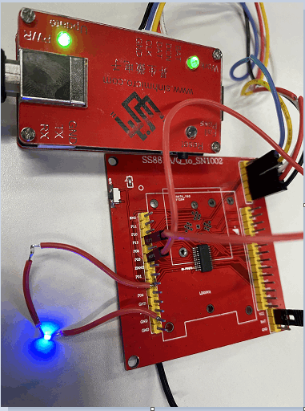
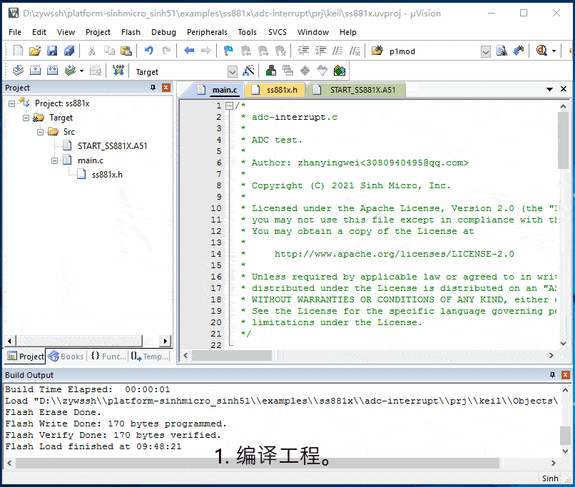

# 1. 功能说明
使用ADC通道2（AN2），测量外部引脚P03电压（在硬件上用杜邦线将P13和P03连接起来），P13输出高电平供给P03，

ADC采样模式为单次采样，每采样一次触发一次ADC中断，在中断服务下，读取P03引脚实际电压值并点亮LED灯。

# 2. 实现步骤

1. 初始化ADC。使能ADC时钟，配置为单次采样模式，使能通道2（AN2），中心电平为2.6V，使能ADC中断。

2. 通过寄存器MFP0，将P03引脚复用为AN2。

3. 配置P13引脚为推挽输出模式，并输出高电平提供给P03引脚。

4. 将寄存器ADCCON0的最高位置1，即开始采样数据。

5. 在中断服务中，调用函数data_an2_read();取出ADC值，将12位补码转换成16位补码，再加上中心电平得到实际电压值。

   2位补码转换成16位补码可参考链接：[adc-vbat-sample/doc/readme.md](../../adc-vbat-sample/doc/readme.md)

   （注意：在中断服务中，需要手动清0 ADC中断标志位（ADCIF），并重新置寄存器ADCCON0的最高位为1，开始下一次采样数据。）

# 3. 代码编译

## 3.1 PlatformIO IDE

### 3.1.1 参考如下链接，搭建PlatformIO IDE的开发环境

http://www.sinhmicro.com.cn/index.php/more/blog/vscode-platformio-sinh51

### 3.1.2 在PlatformIO IDE中打开工程并编译

和其它示例基本一致，不再详细说明，具体请参考：

[led-blink/doc/readme.md](../../led-blink/doc/readme.md)

## 3.2 Keil C51 IDE

### 3.2.1 参考如下链接，搭建Keil C51 IDE的开发环境

http://www.sinhmicro.com/index.php/tool/software/debugger/sinh51_keil

### 3.2.2 在Keil C51 IDE中打开工程并编译

和其它示例基本一致，不再详细说明，具体请参考：

[led-blink/doc/readme.md](../../led-blink/doc/readme.md)

# 4. 测试步骤

## 4.1 通过模拟器测试
### 4.1.1 PlatformIO IDE

暂不支持。

### 4.1.2 Keil C51 IDE
暂不支持。

## 4.2 通过开发板测试

### 4.2.1 参考如下链接，进行硬件连接（用杜邦线将P13和P03连接起来，P13引脚供电电压约4.4V）

http://sinhmicro.com/index.php/tool/hardware/debugger/ssd8

### 4.2.2 通过Flash_Tools烧录固件

和其它示例基本一致，不再详细说明，具体请参考：

[led-blink/doc/readme.md](../../led-blink/doc/readme.md)

### 4.2.3 通过在线调试查看效果

1. 编译工程。
2. 配置工程的调试选项为调试器。
3. 打开Flash烧录软件，烧录固件，连接芯片。
5. 运行代码，查看vbat_mv的值约4.4v，与硬件供电值相符合。

