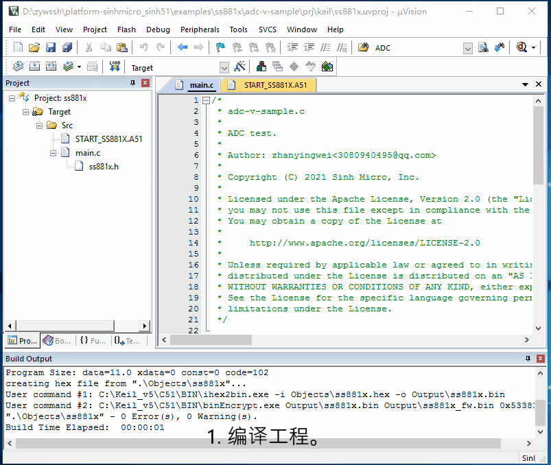

# 1. 功能说明
使用ADC通道0，测量电池电压（VBAT引脚供电电压）。

# 2. 实现步骤

1. 配置ADCCON0寄存器，定义ADC为连续模式,ADC采样时钟1MHz,ADC采样后滤波求均值样本个数128。

2. 配置CLKCON1寄存器，使能ADC。

3. 通过ADCCHEN寄存器，使能电池电压检测通道。

4. 取出ADC值，将12位补码转换成16位补码，再加上中心电平得到实际电压值。

   (将12位补码转换成16位补码，可参考图片理解。)

   

   

# 3. 代码编译

## 3.1 PlatformIO IDE

### 3.1.1 参考如下链接，搭建PlatformIO IDE的开发环境

http://www.sinhmicro.com.cn/index.php/more/blog/vscode-platformio-sinh51

### 3.1.2 在PlatformIO IDE中打开工程并编译

和其它示例基本一致，不再详细说明，具体请参考：

[led-blink/doc/readme.md](../../led-blink/doc/readme.md)

## 3.2 Keil C51 IDE

### 3.2.1 参考如下链接，搭建Keil C51 IDE的开发环境

http://www.sinhmicro.com/index.php/tool/software/debugger/sinh51_keil

### 3.2.2 在Keil C51 IDE中打开工程并编译

和其它示例基本一致，不再详细说明，具体请参考：

[led-blink/doc/readme.md](../../led-blink/doc/readme.md)

# 4. 测试步骤

## 4.1 通过模拟器测试
### 4.1.1 PlatformIO IDE

暂不支持。

### 4.1.2 Keil C51 IDE

1. 编译工程。
2. 配置工程的调试选项为模拟器。
3. 启动调试,设置断点。
4. 在“Peripherals”标签中打开ADC模拟器。
5. 运行代码，调试并观察结果，查看vbat_mv的值。

## 4.2 通过开发板测试

### 4.2.1 参考如下链接，进行硬件连接（调试器的vbat引脚接到开发板的vcc引脚，供电电压约4.4V）

http://sinhmicro.com/index.php/tool/hardware/debugger/ssd8

(注意VCC和BAT用跳线帽短接上，因为测量的是vbat引脚提供的电压)

### 4.2.2 通过Flash_Tools烧录固件

和其它示例基本一致，不再详细说明，具体请参考：

[led-blink/doc/readme.md](../../led-blink/doc/readme.md)

### 4.2.3 通过在线调试查看效果

1. 编译工程。
2. 配置工程的调试选项为调试器。
3. 打开Flash烧录软件，烧录固件，连接芯片。
5. 启动调试，设置断点。
5. 运行代码，查看vbat_mv的值约4.4v，与硬件供电值相符合。

