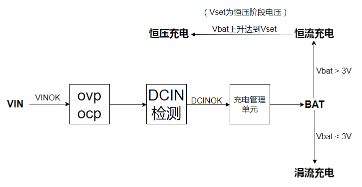
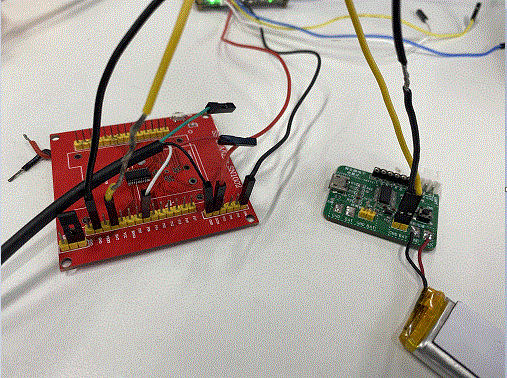
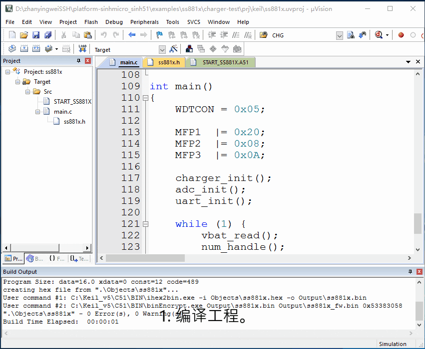

# 1. 功能说明
通过充电管理单元实现对电池充电，并利用串口打印充电电压。

# 2. 实现步骤

1. 初始化充电管理单元。根据电池规格设置恒压电压、恒流电流和最长充电时长。

2. 初始化ADC模块。使能VBAT通道，采取连续采样模式。

3. 初始化UART。设置波特率为19200。

   充电过程思维导图如下：

   

# 3. 代码编译

## 3.1 PlatformIO IDE

### 3.1.1 参考如下链接，搭建PlatformIO IDE的开发环境

http://www.sinhmicro.com.cn/index.php/more/blog/vscode-platformio-sinh51

### 3.1.2 在PlatformIO IDE中打开工程并编译

和其它示例基本一致，不再详细说明，具体请参考：

[led-blink/doc/readme.md](../../led-blink/doc/readme.md)

## 3.2 Keil C51 IDE

### 3.2.1 参考如下链接，搭建Keil C51 IDE的开发环境

http://www.sinhmicro.com/index.php/tool/software/debugger/sinh51_keil

### 3.2.2 在Keil C51 IDE中打开工程并编译

和其它示例基本一致，不再详细说明，具体请参考：

[led-blink/doc/readme.md](../../led-blink/doc/readme.md)

# 4. 测试步骤

## 4.1 通过模拟器测试
### 4.1.1 PlatformIO IDE

暂不支持。

### 4.1.2 Keil C51 IDE
暂不支持。

## 4.2 通过开发板测试

### 4.2.1 参考如下链接，进行硬件连接

http://sinhmicro.com/index.php/tool/hardware/debugger/ssd8

( 黑线均用于接地；红线连接DCIN用于给MCU供电；黄线连接MCU与电池的BAT引脚， 用于给电池充电；白线接P06用于串口发送数据。)

### 4.2.2 通过Flash_Tools烧录固件

和其它示例基本一致，不再详细说明，具体请参考：

[led-blink/doc/readme.md](../../led-blink/doc/readme.md)

### 4.2.3 通过模拟器调试查看效果

1. 编译工程。
2. 配置工程的调试选项为模拟器。
3. 启动调试。
5. 在“Peripherals”标签中打开Serial和ADC模拟器。
5. 运行代码，查看串口打印Vbat值是否等于VBAT通道值。

