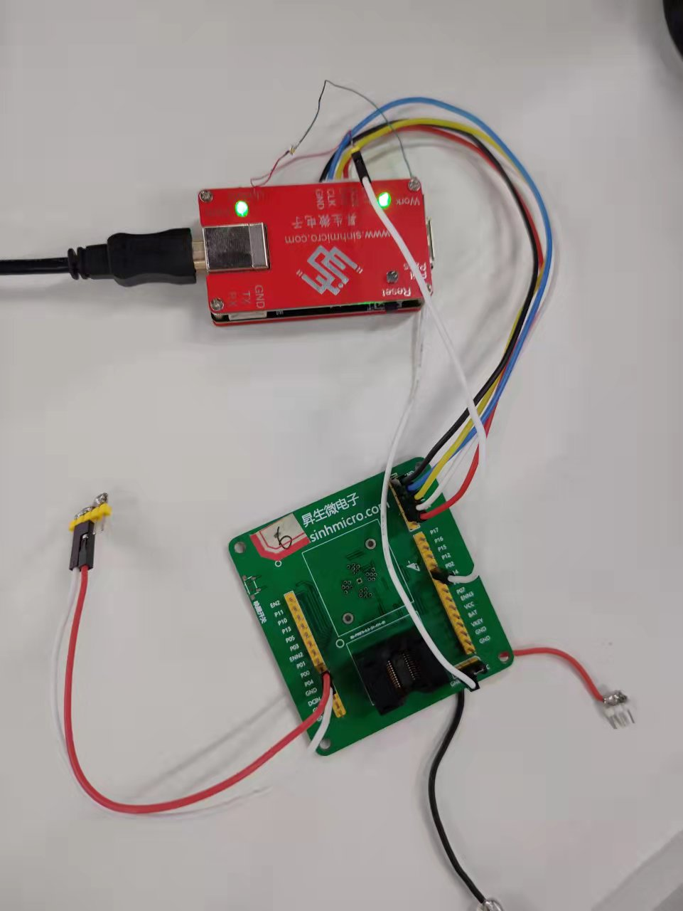

# 1. 功能说明
​		模拟比较器比较及中断功能。

# 2. 功能实现

1. 配置寄存器MFP1 = 0X03，使P04作为CMP1负端，配置寄存器CLKCON1 = 0X04，使CMP模块系统时钟使能。
2. 配置寄存器CMPCON0 = 0Xf0，比较器1使能，正端电压1.5 V，配置寄存器CMPCON1 = 0X10，比较器输出状态 Debounce 时间  > 3 个系统时钟。配置寄存器CMPCON2 = 0X30，当模拟比较器1的比较结果从 1 --> 0 或者 0 --> 1 触发中断。使P02作为输出，每次进入中断P02的输出状态取反。
3. 使P00作为输出，延时100ms输出低电平（0 V），延时100ms输出高电平（4.45V），循环往复。将P04与P00用线连接起来。
4. 当P00输出高电平 ——> P04电平被拉高，此时模拟比较器1的负端电压（5v） > 正端电压（1.5v），模拟比较器1的比较结果RESULT1 = 0。
5. 当P00输出低电平 ——> P04电平被拉低，此时模拟比较器1的负端电压（0v） < 正端电压（1.5v），模拟比较器1的比较结果RESULT1 = 1。
6. 模拟比较器1的比较结果从0 --> 1 或 1 --> 0 不断触发中断，P02的输出状态也不断变化，可以看到灯在不停闪烁。

# 3. 代码编译

## 3.1 PlatformIO IDE

### 3.1.1 参考如下链接，搭建PlatformIO IDE的开发环境

http://www.sinhmicro.com.cn/index.php/more/blog/vscode-platformio-sinh51

### 3.1.2 在PlatformIO IDE中打开工程并编译

和其它示例基本一致，不再详细说明，具体请参考：

[led-blink/doc/readme.md](../../led-blink/doc/readme.md)

## 3.2 Keil C51 IDE

### 3.2.1 参考如下链接，搭建Keil C51 IDE的开发环境

http://www.sinhmicro.com/index.php/tool/software/debugger/sinh51_keil

### 3.2.2 在Keil C51 IDE中打开工程并编译

和其它示例基本一致，不再详细说明，具体请参考：

[led-blink/doc/readme.md](../../led-blink/doc/readme.md)

# 4. 测试步骤

## 4.1 通过模拟器测试
### 4.1.1 PlatformIO IDE

暂不支持。

### 4.1.2 Keil C51 IDE
暂不支持。

## 4.2 通过开发板测试

### 4.2.1 参考如下链接，进行硬件连接

http://sinhmicro.com/index.php/tool/hardware/debugger/ssd8

1. 将P04与P00用线连接起来，P02与LED灯正极相连，GND与LED灯负极相连。

### 4.2.2 通过Flash_Tools烧录固件

和其它示例基本一致，不再详细说明，具体请参考：

[led-blink/doc/readme.md](../../led-blink/doc/readme.md)

### 4.2.3 硬件调试

1. 使用USB B连接线将调试器与PC连接起来。
2. 点击Flash烧录软件，烧录后，点击 “连接按钮” 对开发板进行供电，观察到灯闪烁。
