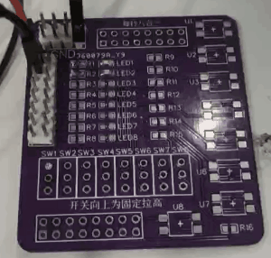

# 1. 功能说明
​	读、写EEPROM

# 2. 功能实现

1.写流程： 

a)  EEPCON使能 写   b)  EEPADR写入地址   c) EEPDAT放入数据  d)  EEPCON激活写周期   e) EEPCON等待写周期清0    f) 重复b-d    g) EEPCON清除读写使能控制

2.读流程

a)  EEPCON使能 读   b)  EEPADR写入地址   c)  EEPCON激活读周期   d) EEPCON等待写周期清0    e) EEPDAT读出数据  c) 重复b-e  d) EEPCON清除读写使能控制

# 3. 代码编译

## 3.1 PlatformIO IDE

### 3.1.1 参考如下链接，搭建PlatformIO IDE的开发环境

http://www.sinhmicro.com.cn/index.php/more/blog/vscode-platformio-sinh51

### 3.1.2 在PlatformIO IDE中打开工程并编译

和其它示例基本一致，不再详细说明，具体请参考：

[led-blink/doc/readme.md](../../led-blink/doc/readme.md)

## 3.2 Keil C51 IDE

### 3.2.1 参考如下链接，搭建Keil C51 IDE的开发环境

http://www.sinhmicro.com/index.php/tool/software/debugger/sinh51_keil

### 3.2.2 在Keil C51 IDE中打开工程并编译

和其它示例基本一致，不再详细说明，具体请参考：

[led-blink/doc/readme.md](../../led-blink/doc/readme.md)

# 4. 测试步骤

## 4.1 通过模拟器测试
### 4.1.1 PlatformIO IDE

暂不支持。

### 4.1.2 Keil C51 IDE
暂不支持。

## 4.2 通过开发板测试

### 4.2.1 参考如下链接，进行硬件连接

http://sinhmicro.com/index.php/tool/hardware/debugger/ssd8

### 4.2.2 通过Flash_Tools烧录固件

和其它示例基本一致，不再详细说明，具体请参考：

[led-blink/doc/readme.md](../../led-blink/doc/readme.md)

### 4.2.3 硬件调试

1. 使用USB B连接线将调试器与PC连接起来。
2. 点击Flash烧录软件，芯片状态下的“连接按钮”。
3. 将P00与LED连接。
4. 程序先写入hello,再读出，如果读出匹配，则使LED闪烁

