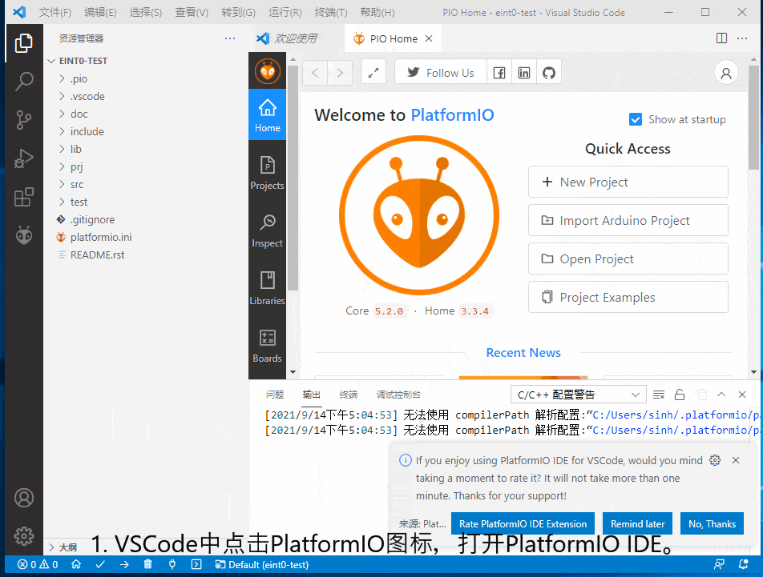
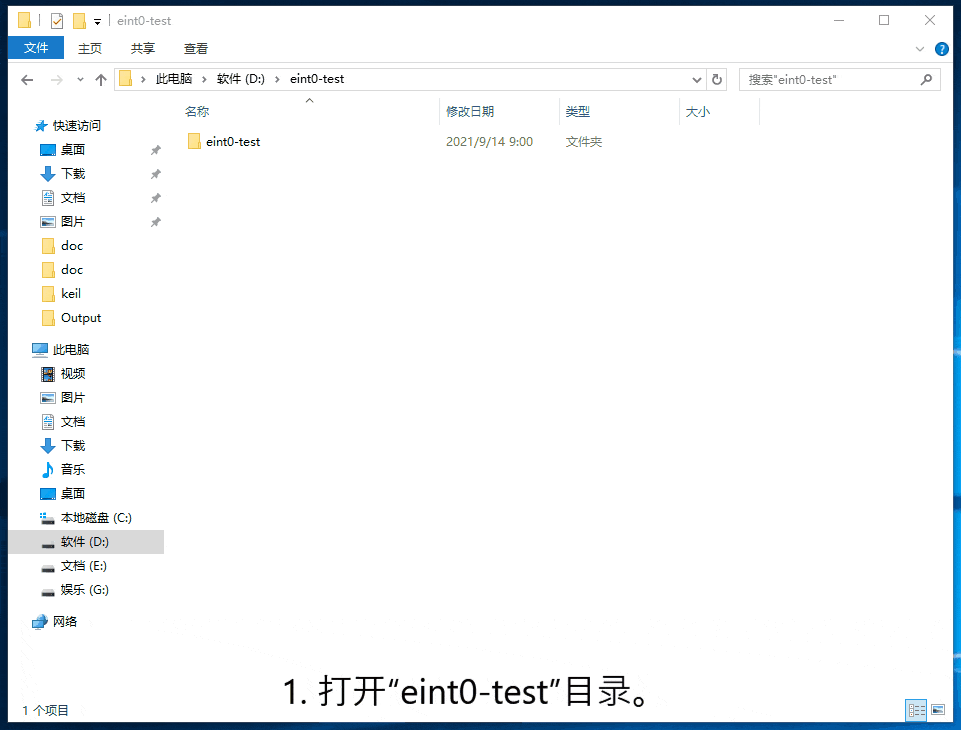
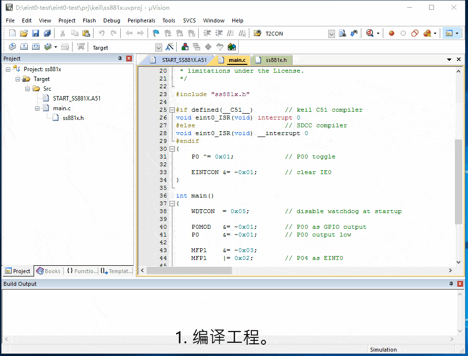
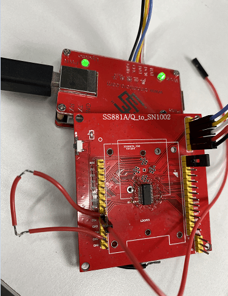
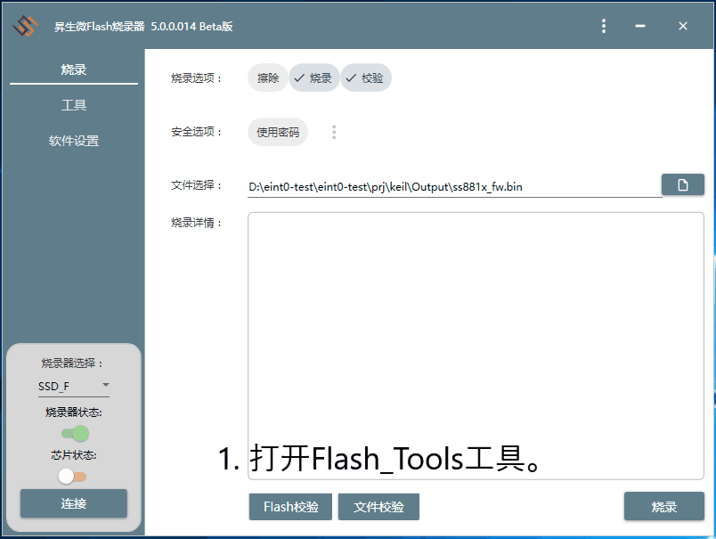

# 1. 功能说明
通过P04引脚或者P10引脚以低电平触发中断，中断服务实现P00引脚状态翻转，模拟LED的闪动。

# 2. 功能实现

通过配置相关寄存器把P04和P10引脚复用为外部中断0引脚，并配置为低电平触发中断，在中断服务函数中，实现P00引脚状态翻转，即LED灯闪烁，

由于LED灯点亮之后还有余晖，在硬件调试上，很难看出LED闪烁，所以我们在中断服务函数内调用 _delay_ms(250); 进行一段延时。

# 3. 代码编译

## 3.1 PlatformIO IDE

### 3.1.1 参考如下链接，搭建PlatformIO IDE的开发环境

http://www.sinhmicro.com.cn/index.php/more/blog/vscode-platformio-sinh51

### 3.1.2 在PlatformIO IDE中打开工程并编译

1. VSCode中点击PlatformIO图标，打开PlatformIO IDE。
2. 点击Open，打开PlatformIO的Home界面。
3. 在“Projects”界面，点击“Add Existing”添加“eint0-test”工程。
4. 在弹出的文件浏览窗口中，找到并打开“eint0-test”目录。
5. 打开目录后，在列出的工程标签中打开工程。
6. 点击PlatformIO的图标，找到“PROJECT TASKS”标签。
7. 点击"Build"按钮，编译工程。
8. “.pio\build\ss881a”目录中生成非加密的二进制文件。

## 3.2 Keil C51 IDE

### 3.2.1 参考如下链接，搭建Keil C51 IDE的开发环境

http://www.sinhmicro.com/index.php/tool/software/debugger/sinh51_keil

### 3.2.2 在Keil C51 IDE中打开工程并编译

1. 打开“eint0-test”目录。
2. 打开"prj-->keil"目录。
3. 打开“ss881x.uvproj"工程文件。
4. 点击编译按钮，编译工程。
5. 生成”ss881x.bin"非加密固件。
6. 生成”ss881x_fw.bin"加密固件。
7. 编译生成的固件位于“Output”目录中。

# 4. 测试步骤

## 4.1 通过模拟器测试
### 4.1.1 PlatformIO IDE

暂不支持。

### 4.1.2 Keil C51 IDE

1. 编译工程。
2. 打开"Option-->Debug"界面。
3. 配置工程的调试选项为模拟器。
4. 启动调试。
5. 在“Peripherals”标签中打开I/O模拟器。
6. 运行代码，通过I/O或LED模拟器观察执行效果。
7. P04为高电平不触发中断，P00状态不翻转
8. P04为低电平触发中断，P00状态翻转，LED闪烁

## 4.2 通过开发板测试

### 4.2.1 参考如下链接，进行硬件连接

http://sinhmicro.com/index.php/tool/hardware/debugger/ssd8

### 4.2.2 通过Flash_Tools烧录固件

1. 打开Flash_Tools工具。
2. 点击“连接”按钮。
3. 选择相应的固件,固件位于“Output”目录中。
4. 点击“烧录”按钮，查看烧录状态。

### 4.2.3 硬件调试

1. 使用USB B连接线将调试器与PC连接起来。

2. 点击Flash烧录软件，芯片状态下的“连接按钮”。

3. 这里选择的是P04引脚为外部中断0，由于P04接按键引脚的一端，默认被下拉，所以一上电就会看到LED不断闪烁。

   （如果选择P10引脚，P10引脚默认是悬空状态。）

4. 默认P04触发为低电平，触发中断，LED闪烁。

5. 把P04引脚接到VCC，中断不触发，LED不闪烁。
