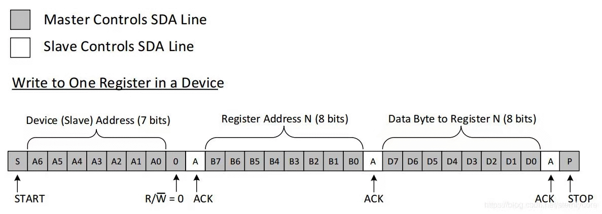
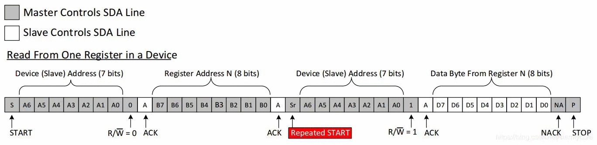
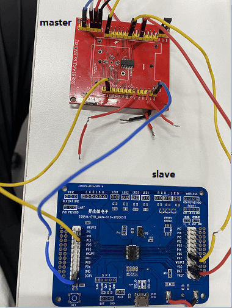
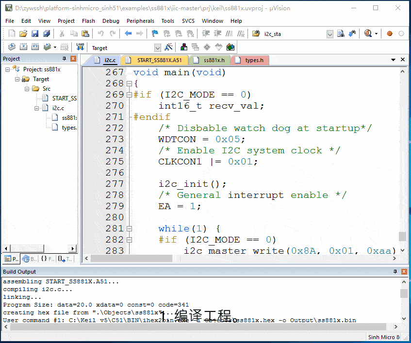

# 1. 功能说明
使用IIC通信协议，主设备发送一个字节数据给从设备，从设备（地址为0x8A）模拟出一个I2C的EEPROM设备（地址为0x01，大小为5个字节），从设备将接收到的数据存放在EEPROM设备中地址为0x01的寄存器中。主机再读取从机EEPROM设备中地址为0x01的寄存器中的值。实验用到两个开发板，一个作为主机，一个作为从机。

# 2. 实现步骤

1. 初始化IIC接口。通过寄存器CLKCON1使能I2C时钟，通过IICDIV寄存器配置I2C接口速度，通过寄存器IICCON配置上拉电阻、选择主模式或者从模式、使能I2C接口。（注意：通过寄存器MFP1将P06选择为IIC的数据线引脚，通过寄存器MFP3将P11选择为IIC的时钟线引脚。）

2. 主设备发送，从设备接收。主机先产生起始信号（将寄存器IICCON（bit5:4）置为01产生起始信号），再发送从机地址（将从机地址（0x8A）写入到IICDA寄存器（bit0=0,主机写）），从机（地址为0x8A）读取到该地址后回应ACK，主机再发送寄存器地址（0x01），从机继续回应ACK，此时从机准备完毕，主机发送数据（将要发送的数据写入到IICDA寄存器），从机成功接收完一字节数据后，将数据存放在寄存器中（寄存器地址为0x01），从机继续回应ACK给主机，主机产生停止信号（将寄存器IICCON（bit5:4）设置为10产生停止信号，若寄存器IICSTAT（bit2）为1，说明成功发生停止信号），结束发送。

   主机发送-从机接收，可参考下图理解：

   

3. 主设备接收，从设备发送。主机先产生起始信号（将寄存器IICCON（bit5:4）置为01产生起始信号），主机发送从机地址（将从机地址（0x8A）写入到IICDA寄存器（bit0=0,主机写）），从机（地址为0x8A）读取到该地址后回应ACK，主机继续发送寄存器地址（0x01），从机回应ACK，主机继续发送重复起始信号（将寄存器IICCON（bit5:4）设置为11产生重复起始信号），再马上发送从机地址（此时IICDA寄存器的bit0=1,表示主机读），从机继续回应ACK，此时主机释放SDA线转由从机控制，从机将EEPROM设备中地址为0x01的寄存器中的值发送到SDA总线上，主机读取SDA线进行数据接收，主机接收完数据，主机将会返回NACK给从机，告诉从机释放SDA总线，随后主机控制SDA总线并发送停止信号（将寄存器IICCON（bit5:4）设置为10产生停止信号，若寄存器IICSTAT（bit2）为1，说明成功发生停止信号），总线释放，完成读操作。

   主机读数据-从机发送，可参考下图理解：

   

# 3. 代码编译

## 3.1 PlatformIO IDE

### 3.1.1 参考如下链接，搭建PlatformIO IDE的开发环境

http://www.sinhmicro.com.cn/index.php/more/blog/vscode-platformio-sinh51

### 3.1.2 在PlatformIO IDE中打开工程并编译

和其它示例基本一致，不再详细说明，具体请参考：

[led-blink/doc/readme.md](../../led-blink/doc/readme.md)

## 3.2 Keil C51 IDE

### 3.2.1 参考如下链接，搭建Keil C51 IDE的开发环境

http://www.sinhmicro.com/index.php/tool/software/debugger/sinh51_keil

### 3.2.2 在Keil C51 IDE中打开工程并编译

和其它示例基本一致，不再详细说明，具体请参考：

[led-blink/doc/readme.md](../../led-blink/doc/readme.md)

# 4. 测试步骤

## 4.1 通过模拟器测试
### 4.1.1 PlatformIO IDE

暂不支持。

### 4.1.2 Keil C51 IDE
暂不支持。

## 4.2 通过开发板测试

### 4.2.1 参考如下链接，进行硬件连接

http://sinhmicro.com/index.php/tool/hardware/debugger/ssd8

（使用杜邦线：将主、从机的P06引脚连通作为数据总线（SDA）；将主、从机的P11引脚连通作为时钟总线（SCL）；主、从机的VCC引脚需要连通，用于主机给从机供电；主机与从机需要共地；由于数据总线（SDA）占用了P06引脚，所以调试器的DA引脚应与MCU的P17引脚连接。）

### 4.2.2 通过Flash_Tools烧录固件

和其它示例基本一致，不再详细说明，具体请参考：

[led-blink/doc/readme.md](../../led-blink/doc/readme.md)

### 4.2.3 通过在线调试查看效果（可以使用示波器抓波查看通信过程，有助于了解IIC通信协议）

1. 编译工程。

2. 配置工程的调试选项为调试器。

3. 打开Flash烧录软件，烧录固件，连接芯片。

4. 运行代码，查看recv_val的值。

   （主设备烧录主机代码（宏定义I2C_MODE的值为0），从设备烧录从机代码（宏定义I2C_MODE的值为1），主机将数据0xaa发送给从机，并存储在从机EEPROM设备中地址为0x01的寄存器中；主机再读取从机EEPROM设备中地址为0x01的寄存器中的值。）

   

