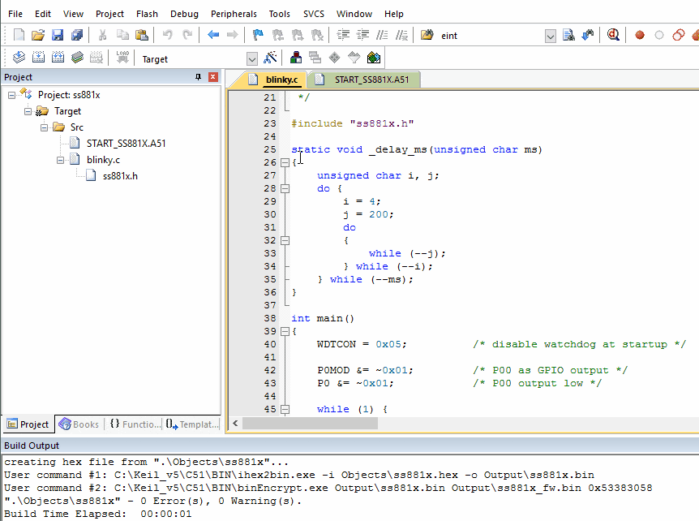

# 1. 功能说明
以大约1Hz的频率（高500ms、低500ms），拉高、拉低P00引脚，模拟LED的闪动。

# 2. 代码编译

## 2.1 PlatformIO IDE

### 2.1.1 参考如下链接，搭建PlatformIO IDE的开发环境

http://www.sinhmicro.com.cn/index.php/more/blog/vscode-platformio-sinh51

### 2.1.2 在PlatformIO IDE中打开工程并编译

1. VSCode中点击PlatformIO图标，打开PlatformIO IDE。
2. 点击Open，打开PlatformIO的Home界面。
3. 在“Projects”界面，点击“Add Existing”添加“led-blink”工程。
4. 在弹出的文件浏览窗口中，找到并打开“led-blink”目录。
5. 打开目录后，在列出的工程标签中打开工程。
6. 点击PlatformIO的图标，找到“PROJECT TASKS”标签。
7. 点击"Build"按钮，编译工程。
8. “.pio\build\ss881a”目录中生成非加密的二进制文件。

## 2.2 Keil C51 IDE

### 2.2.1 参考如下链接，搭建Keil C51 IDE的开发环境

http://www.sinhmicro.com/index.php/tool/software/debugger/sinh51_keil

### 2.2.2 在Keil C51 IDE中打开工程并编译

1. 打开“blink-led”目录。
2. 打开"prj-->keil"目录。
3. 打开“ss881x.uvproj"工程文件。
4. 点击编译按钮，编译工程。
5. 生成”ss881x.bin"非加密固件。
6. 生成”ss881x_fw.bin"加密固件。
7. 编译生成的固件位于“Output”目录中。

# 3. 测试步骤

## 3.1 通过模拟器测试
### 3.1.1 PlatformIO IDE

暂不支持。

### 3.1.2 Keil C51 IDE

1. 编译工程。
2. 打开"Option-->Debug"界面。
3. 配置工程的调试选项为模拟器。
4. 启动调试。
5. 在“Peripherals”标签中打开I/O模拟器。
6. 运行代码，通过I/O或LED模拟器观察执行效果。

## 3.2 通过开发板测试
