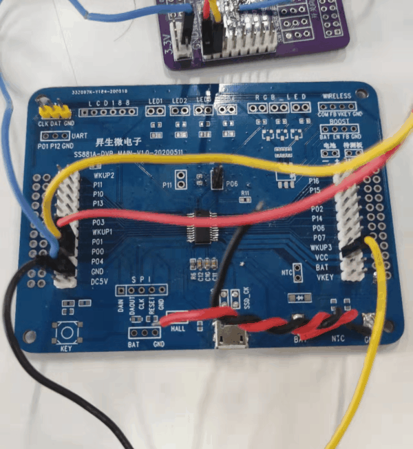

# 1. 功能说明

​	使用低电压复位功能。

# 2. 背景介绍

电源架构：

OPV：Over Voltage Protect  过压保护

OCP:   Over Current Protect 过流保护

OVD:   Over Voltage Detect  过压检测

​	根据图片理解，VDD节点的电压可由VDD引脚直接提供，也可由SPWR和VIN提供。VDD是系统供电节点，与BAT无任何关系，电池充电由SPWR或VIN到BAT引脚。请尽量使用VIN进行供电，SPWR无过压保护和过流保护功能。

​	如果电池需要向系统供电，根据MCU型号，将VDD和BAT进行外部或者内部绑定及可。

外部绑定：注意需要二极管

内部绑定：

​	外部绑定使用二极管原因：  如果电池端无电，此时VDD端将直接被BAT拉低，而MCU将得不到供电无法运行，而充电管理单元也就无法给电池充电。

# 3. 功能实现

​    当VDD电压低到设置的复位档位，且保持达到200us,就进入复位，当电压高于低电压复位档位0.2V复位被释放。 

​	此功能的配置都在PWRCON2寄存器中，注意低电压复位要开启低电压检测功能。

​	首先，配置低电压复位门限（在此实验中，将VDD低电压复位门限设置为了3.85V。），再配置低电压检测门限，最后使能低电压检测和低电压复位功能。

# 3. 代码编译

## 4.1 PlatformIO IDE

### 4.1.1 参考如下链接，搭建PlatformIO IDE的开发环境

http://www.sinhmicro.com.cn/index.php/more/blog/vscode-platformio-sinh51

### 4.1.2 在PlatformIO IDE中打开工程并编译

和其它示例基本一致，不再详细说明，具体请参考：

[led-blink/doc/readme.md](../../led-blink/doc/readme.md)

## 4.2 Keil C51 IDE

### 4.2.1 参考如下链接，搭建Keil C51 IDE的开发环境

http://www.sinhmicro.com/index.php/tool/software/debugger/sinh51_keil

### 4.2.2 在Keil C51 IDE中打开工程并编译

和其它示例基本一致，不再详细说明，具体请参考：

[led-blink/doc/readme.md](../../led-blink/doc/readme.md)

# 5. 测试步骤

## 5.1 通过模拟器测试
### 5.1.1 PlatformIO IDE

暂不支持。

### 5.1.2 Keil C51 IDE
暂不支持。

## 5.2 通过开发板测试

### 5.2.1 参考如下链接，进行硬件连接

http://sinhmicro.com/index.php/tool/hardware/debugger/ssd8

### 5.2.2 通过Flash_Tools烧录固件

和其它示例基本一致，不再详细说明，具体请参考：

[led-blink/doc/readme.md](../../led-blink/doc/readme.md)

### 5.2.3 硬件调试

1. 使用稳压电源，设置正常运行和低电压的两个状态

   正常运行：

   

   低电压：

   

   

2. 使用杜邦线将P00,P01分别接在两个LED灯上，且稳压电源的正极连接VDD(VCC),负极连接GND

   

3. 将稳压电源调节至5V档位，上电后P01闪烁，表示MCU正常运行

5. 将稳压电源调至3.6V档位后（此时两个灯都无输出，MCU处于关闭状态）再调节回5V档位（此时MCU重启），可以看到P00闪烁两次，表示读到低电压复位标志。之后P01闪烁，MCU正常运行。

