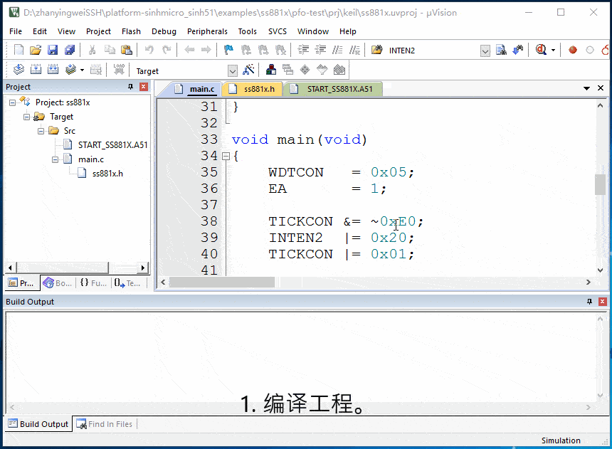
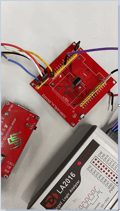

# 1. 功能说明
配置可编程频率输出单元，生成可编程的频率信号，每隔2s,轮流输出1.7MHz、2.4MHz和3MHz的高频PWM输出。

# 2. 功能实现

1. 通过MFP1寄存器将P07复用为可编程频率输出（PF0）引脚；
2. 通过CLKCON1寄存器时钟使能可编程频率输出单元（PFOU）；
3. 通过PRCCON1寄存器的高三位和PRCFREQL寄存器设置PRCFEQ[10：0]的值；通过PRCCON1寄存器设置相应的分频系数。
4. 通过PRCCON0寄存器选择相应的中心频率，并使能PRC。

# 3. 代码编译

## 3.1 PlatformIO IDE

### 3.1.1 参考如下链接，搭建PlatformIO IDE的开发环境

http://www.sinhmicro.com.cn/index.php/more/blog/vscode-platformio-sinh51

### 3.1.2 在PlatformIO IDE中打开工程并编译

和其它示例基本一致，不再详细说明，具体请参考：

[led-blink/doc/readme.md](../../led-blink/doc/readme.md)

## 3.2 Keil C51 IDE

### 3.2.1 参考如下链接，搭建Keil C51 IDE的开发环境

http://www.sinhmicro.com/index.php/tool/software/debugger/sinh51_keil

### 3.2.2 在Keil C51 IDE中打开工程并编译

和其它示例基本一致，不再详细说明，具体请参考：

[led-blink/doc/readme.md](../../led-blink/doc/readme.md)

# 4. 测试步骤

## 4.1 通过模拟器测试
### 4.1.1 PlatformIO IDE

暂不支持。

### 4.1.2 Keil C51 IDE

1. 编译工程。

2. 打开"Option-->Debug"界面。

3. 配置工程的调试选项为模拟器。

4. 启动调试。

5. 在“Peripherals”标签中打开Systerm模拟器。

6. 运行代码，通过Systerm模拟器观察执行效果。

   （每隔2s,轮流输出1.7MHz、2.4MHz和3MHz的高频PWM输出。）

## 4.2 通过开发板测试

### 4.2.1 参考如下链接，进行硬件连接

http://sinhmicro.com/index.php/tool/hardware/debugger/ssd8

（P07作为PFO引脚。）

### 4.2.2 通过Flash_Tools烧录固件

和其它示例基本一致，不再详细说明，具体请参考：

[led-blink/doc/readme.md](../../led-blink/doc/readme.md)

### 4.2.3 硬件调试

这里不再演示。

（可使用逻辑分析仪抓波调试，注意延时应该小一点。）

