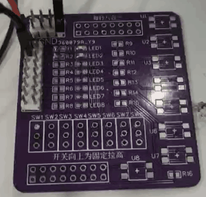

# 1. 功能说明
​	配置通过P03引脚实现RESET(低电平复位)。

# 2. 功能实现

​    RESET引脚复位，需要使用前外部或内部上拉。

​    首先P0PU寄存器配置P03内部上拉，然后MFP0复用P03为RESET功能。在复位结束后，读RESETS寄存器中RESET复位标志，读到则让P00闪烁两次，并让RESETS中复位标志置0。

# 3. 代码编译

## 3.1 PlatformIO IDE

### 3.1.1 参考如下链接，搭建PlatformIO IDE的开发环境

http://www.sinhmicro.com.cn/index.php/more/blog/vscode-platformio-sinh51

### 3.1.2 在PlatformIO IDE中打开工程并编译

和其它示例基本一致，不再详细说明，具体请参考：

[led-blink/doc/readme.md](../../led-blink/doc/readme.md)

## 3.2 Keil C51 IDE

### 3.2.1 参考如下链接，搭建Keil C51 IDE的开发环境

http://www.sinhmicro.com/index.php/tool/software/debugger/sinh51_keil

### 3.2.2 在Keil C51 IDE中打开工程并编译

和其它示例基本一致，不再详细说明，具体请参考：

[led-blink/doc/readme.md](../../led-blink/doc/readme.md)

# 4. 测试步骤

## 4.1 通过模拟器测试
### 4.1.1 PlatformIO IDE

暂不支持。

### 4.1.2 Keil C51 IDE
暂不支持。

## 4.2 通过开发板测试

### 4.2.1 参考如下链接，进行硬件连接

http://sinhmicro.com/index.php/tool/hardware/debugger/ssd8

### 4.2.2 通过Flash_Tools烧录固件

和其它示例基本一致，不再详细说明，具体请参考：

[led-blink/doc/readme.md](../../led-blink/doc/readme.md)

### 4.2.3 硬件调试

1. 使用USB B连接线将调试器与PC连接起来。

2. 点击Flash烧录软件，芯片状态下的“连接按钮”。

3. 将P00和P01分别连接到两个LED上

   

   ​																			正常上电P01LED闪烁

   4.将P03通过杜邦线接地1-2s

   

   ​													可以观察到P00LED闪烁两次后P01正常闪烁
