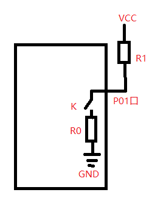
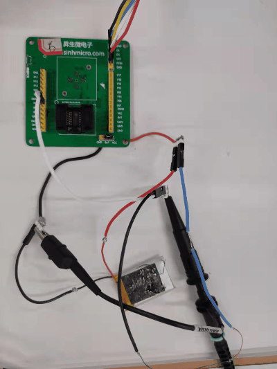
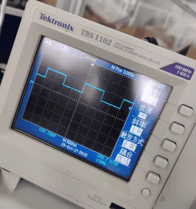

# 1. 功能说明
​		下拉电阻的测量。下拉电阻有 40 KΩ @ 5 V 和 80 KΩ @ 3 V 两种规格，硬件会根据系统电压 ( VCC ) 自动选择。

# 2. 功能实现

1. 将P01配置为输入，并通过下拉电阻使其接地，通过外接电路测量下拉电阻阻值，外接电路如下图。

   

2. 当下拉电阻使能时，K闭合，电路导通。 可以测出下拉电阻 R0 为：
$$
R0 = U(P01)/I = R1*U(P01)/(VCC-U(P01))
$$

3. 当下拉电阻不使能时，K断开，U(P01) = VCC。 

# 3. 代码编译

## 3.1 PlatformIO IDE

### 3.1.1 参考如下链接，搭建PlatformIO IDE的开发环境

http://www.sinhmicro.com.cn/index.php/more/blog/vscode-platformio-sinh51

### 3.1.2 在PlatformIO IDE中打开工程并编译

和其它示例基本一致，不再详细说明，具体请参考：

[led-blink/doc/readme.md](../../led-blink/doc/readme.md)

## 3.2 Keil C51 IDE

### 3.2.1 参考如下链接，搭建Keil C51 IDE的开发环境

http://www.sinhmicro.com/index.php/tool/software/debugger/sinh51_keil

### 3.2.2 在Keil C51 IDE中打开工程并编译

和其它示例基本一致，不再详细说明，具体请参考：

[led-blink/doc/readme.md](../../led-blink/doc/readme.md)

# 4. 测试步骤

## 4.1 通过模拟器测试
### 4.1.1 PlatformIO IDE

暂不支持。

### 4.1.2 Keil C51 IDE
暂不支持。

## 4.2 通过开发板测试

### 4.2.1 参考如下链接，进行硬件连接

http://sinhmicro.com/index.php/tool/hardware/debugger/ssd8

1. 将电池正负极与开发板正负极相连进行供电。电池电压为4V，则VCC = 4V。
2. 将电阻R1（39kΩ）一端与P01连起来，另一端接到电池正极上构成通路。
3. 用示波器测量P01处电压（没有示波器也可以用万用表测量）。

### 4.2.2 通过Flash_Tools烧录固件

和其它示例基本一致，不再详细说明，具体请参考：

[led-blink/doc/readme.md](../../led-blink/doc/readme.md)

### 4.2.3 硬件调试

1. 系统上电后，程序运行，每隔1s下拉电阻使能1s。
2. 当下拉电阻使能时，K闭合，电路导通， U(P01) = 2V，计算得出下拉电阻为39kΩ，与预期相符。
3. 当下拉电阻不使能时，K断开，U(P01) = 4V，与预期相符。

