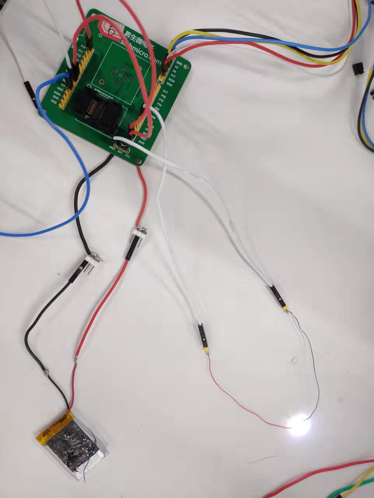

# 1. 功能说明
​	休眠，并通过 WKUP0 唤醒源唤醒。

# 2. 功能实现

1. 关闭所有休眠唤醒源：对 EFR10H 寄存器进行操作，不使能 TS0 唤醒；将 WKUP1 与 WKUP2 与 GND 或 VCC 用线连接，使其有稳定的电平，从而使其处于不唤醒状态；对于 WKUP0 与 WKUP3 ，在 DSEN = 1进入休眠模式前，硬件会自动将WKUP0置低电平，WKUP3置高电平，从而使其处于不唤醒状态；电源适配器断开，使用外接电池进行测试。
2. 令 DSEN = 1进入休眠模式。此时系统停止运行。
3. 当 WKUP0 引脚用线与高电平连接时被唤醒，系统重新运行。

# 3. 代码编译

## 3.1 PlatformIO IDE

### 3.1.1 参考如下链接，搭建PlatformIO IDE的开发环境

http://www.sinhmicro.com.cn/index.php/more/blog/vscode-platformio-sinh51

### 3.1.2 在PlatformIO IDE中打开工程并编译

和其它示例基本一致，不再详细说明，具体请参考：

[led-blink/doc/readme.md](../../led-blink/doc/readme.md)

## 3.2 Keil C51 IDE

### 3.2.1 参考如下链接，搭建Keil C51 IDE的开发环境

http://www.sinhmicro.com/index.php/tool/software/debugger/sinh51_keil

### 3.2.2 在Keil C51 IDE中打开工程并编译

和其它示例基本一致，不再详细说明，具体请参考：

[led-blink/doc/readme.md](../../led-blink/doc/readme.md)

# 4. 测试步骤

## 4.1 通过模拟器测试
### 4.1.1 PlatformIO IDE

暂不支持。

### 4.1.2 Keil C51 IDE
暂不支持。

## 4.2 通过开发板测试

### 4.2.1 参考如下链接，进行硬件连接

http://sinhmicro.com/index.php/tool/hardware/debugger/ssd8

1. 将电池正负极与开发板连接起来。
2. 将 WKUP1 与 WKUP2 与 GND 用线连接。
3. 将 LED 灯正极与 P07 连接，负极与 GND 连接。

### 4.2.2 通过Flash_Tools烧录固件

和其它示例基本一致，不再详细说明，具体请参考：

[led-blink/doc/readme.md](../../led-blink/doc/readme.md)

### 4.2.3 硬件调试

1. 开发板供电后，系统运行，灯亮。
2. 将 P01 与 GND 用线连接后，程序跳出循环，进入休眠函数，从而进入休眠，灯灭。
3. 将P01 与 GND断开，将 WKUP0（P04）与 VCC 连接后，此时 WKUP0 高电平唤醒模式生效，系统重新运行，灯亮。

