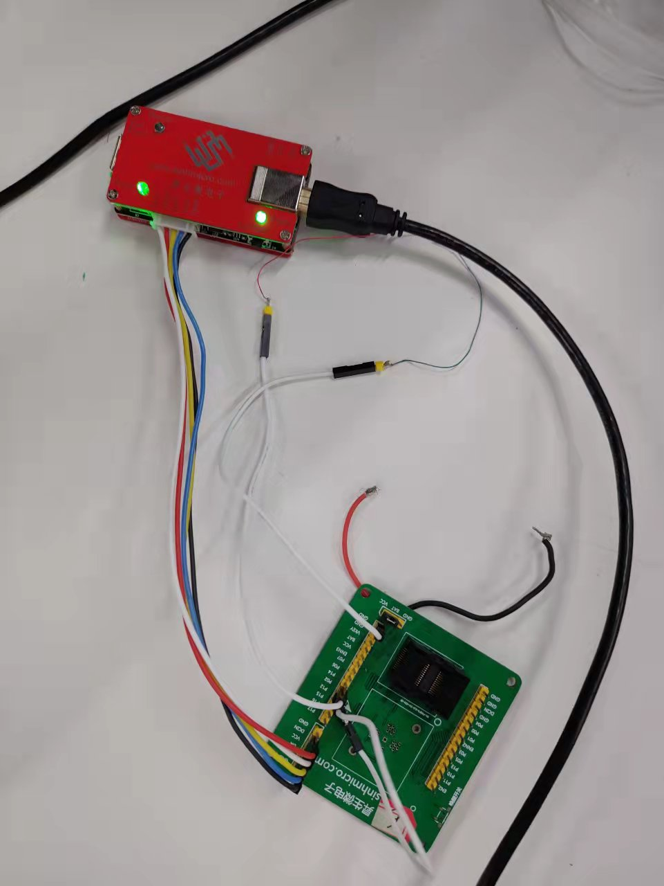

# 1. 功能说明
​	用定时器2中的CC0口发出PWM波形，使其从P02口输出。从P12接入外部输入信号保护，当从P12上测得高电平时，触发保护使P02输出低电平。

# 2. 功能实现

- 配置T2MOD寄存器，使定时器2的TCCM0工作在比较功能，T2CON寄存器配置定时器0时钟为系统时钟的6分频（TCLK0=SCLK/2=2MHz ）。计算定时器初值TL2= 0Xc0，TH2_0 = 0X00，TH2_1= 0X00（为了严谨设定初值，可不设）；装载值TRL2= 0Xc0，TRH2_0 = 0X00，TRH2_1= 0X00（决定了PWM的频率为250HZ）；比较值决定了PWM的空占比，第一组TCC0L=0XFF，TCC0H=0X1F，第二组TCC0L=0XFF，TCC0H=0X0F。同时使P02作为CC0的输出口。

- 配置SPPCON寄存器，使smart PWM保护工作在外部输入高电平信号触发保护模式，EFRADR=0X50，EFRDAT=0X18。配置SPPVAL寄存器，使smart PWM触发保护时CC0口输出低电平，EFRADR=0X51，EFRDAT=0X01。

  **注意：对于EFR类寄存器，先将地址写入EFRADR中，再将数据写入EFRDAT中**

# 3. 代码编译

## 3.1 PlatformIO IDE

### 3.1.1 参考如下链接，搭建PlatformIO IDE的开发环境

http://www.sinhmicro.com.cn/index.php/more/blog/vscode-platformio-sinh51

### 3.1.2 在PlatformIO IDE中打开工程并编译

和其它示例基本一致，不再详细说明，具体请参考：

[led-blink/doc/readme.md](../../led-blink/doc/readme.md)

## 3.2 Keil C51 IDE

### 3.2.1 参考如下链接，搭建Keil C51 IDE的开发环境

http://www.sinhmicro.com/index.php/tool/software/debugger/sinh51_keil

### 3.2.2 在Keil C51 IDE中打开工程并编译

和其它示例基本一致，不再详细说明，具体请参考：

[led-blink/doc/readme.md](../../led-blink/doc/readme.md)

# 4. 测试步骤

## 4.1 通过模拟器测试
### 4.1.1 PlatformIO IDE

暂不支持。

### 4.1.2 Keil C51 IDE
暂不支持。

## 4.2 通过开发板测试

### 4.2.1 参考如下链接，进行硬件连接

http://sinhmicro.com/index.php/tool/hardware/debugger/ssd8

1. 在开发板上将LED灯正极连到P02，负极连到GND。
2. 从P12引出一根线备用。

### 4.2.2 通过Flash_Tools烧录固件

和其它示例基本一致，不再详细说明，具体请参考：

[led-blink/doc/readme.md](../../led-blink/doc/readme.md)

### 4.2.3 硬件调试

2. 使用USB B连接线将调试器与PC连接起来。
3. 点击Flash烧录软件，芯片状态下的“连接按钮”。
4. 在keil C51上点击调试。
5. 调试运行后，灯会闪烁（空占比决定了灯的亮度），此时从P12引出一根线接到VCC中，P12接收到高电平信号，触发保护，灯灭。
