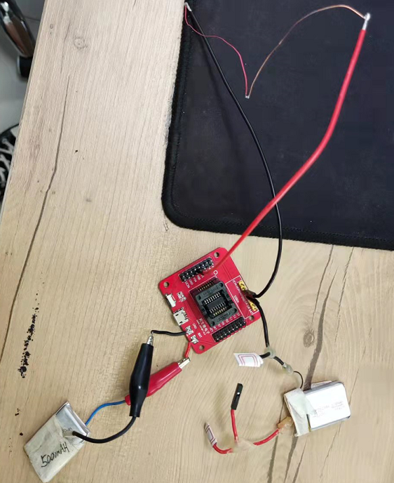
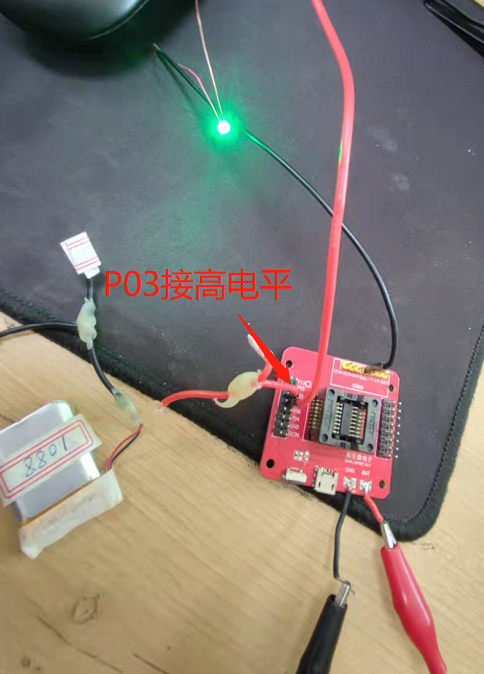

# 1. 功能说明
从正常模式进入待机状态，并通过I/O唤醒源唤醒，本例程是配置P03作为唤醒源，通过配置P01为高电平，验证唤醒。当外部P03给高电平时唤醒后p01输出高电平。

# 2. 功能实现

1. 关闭看门狗，配置CLKCON0寄存器为高频SCLK ，分频系数为1，并设置延迟，等高频稳定；
2. 关闭所有唤醒源；
3. 配置MFP0、P0MOD寄存器，将P03配置为输入模式，再通过PCON寄存器将P03作为唤醒源，将P01配置输出0（作为后面验证唤醒的标志）；
4. 延迟后，配置CLKCON0开启低频，再配置PCON开启待机模式，同时配置P01输出1；
5. 等待P03接入高电平唤醒；
6. 唤醒后P01正常输出高电平1。

# 3. 代码编译

## 3.1 PlatformIO IDE

### 3.1.1 参考如下链接，搭建PlatformIO IDE的开发环境

http://www.sinhmicro.com.cn/index.php/more/blog/vscode-platformio-sinh51

### 3.1.2 在PlatformIO IDE中打开工程并编译

暂不支持

## 3.2 Keil C51 IDE

### 3.2.1 参考如下链接，搭建Keil C51 IDE的开发环境

http://www.sinhmicro.com/index.php/tool/software/debugger/sinh51_keil

### 3.2.2 在Keil C51 IDE中打开工程并编译

暂不支持

# 4. 测试步骤

## 4.1 通过模拟器测试
### 4.1.1 PlatformIO IDE

暂不支持。

### 4.1.2 Keil C51 IDE
暂不支持

## 4.2 通过开发板测试

### 4.2.1 参考如下链接，进行硬件连接

http://sinhmicro.com/index.php/tool/hardware/debugger/ssd8

### 4.2.2 通过Flash_Tools烧录固件

1. 打开Flash_Tools工具。
2. 点击“连接”按钮。
3. 选择相应的固件,固件位于“Output”目录中。
4. 点击“烧录”按钮，查看烧录状态。

### 4.2.3 硬件调试

将LED接入P01，处于待机模式下，P01输出低电平,LED没亮：

等P03接入高电平，唤醒后P01输出高电平，LED亮起：

