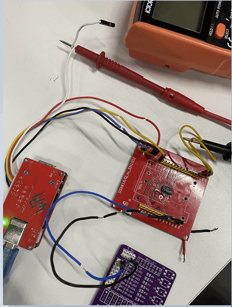

# 1. 功能说明
每隔约1s LED灯闪烁一次：灯灭时，系统处于待机状态；灯亮时，系统处于正常模式。（使用看门狗定时器（Watchdog）将系统从待机状态(STOP)唤醒。）

# 2. 实现步骤

1. 关闭所有唤醒源。stop模式的唤醒源有DCIN接入唤醒、VKEY按键唤醒、看门狗定时器唤醒、（TS0）唤醒、I/O端口（P01/P02/P03/P04/P06/P07/P11/P20）唤醒。(注意：使用ADC & Charger模块的寄存器前，需要软件置CLKCON1寄存器（bit3）为1。)
2. 通过P0MOD寄存器设置P00为输出模式，通过P0DAT寄存器设置P00输出高。（因为系统刚上电默认进入正常模式，所以我们让灯亮起来。）
3. 选择看门狗定时器为唤醒源。置CLKCON0寄存器（bit6）为1，使能看门狗定时器作为待机模式唤醒源。配置WDTCON寄存器，使能看门狗定时器,溢出时间为2s,空闲状态不工作。
4. 进入待机模式。置PCON寄存器（bit1）为1，进入待机模式。（在进入待机模式前，应该通过CLKCON0寄存器选择SCLK源头为低频RC(LORC)，通过RCCON寄存器关闭高频RC；使待机状态下，系统处于低功耗模式。）
5. 等待看门狗唤醒。看门狗唤醒系统后，系统进入正常模式，在正常模式下，选择系统时钟源为高频模式。（通过CLKCON0寄存器选择SCLK源头为高频RC(HIRC)，通过RCCON寄存器使能高频RC。）
6. 及时喂狗。在看门狗定时没溢出前置WDTCLR为1。

# 3. 代码编译

## 3.1 PlatformIO IDE

### 3.1.1 参考如下链接，搭建PlatformIO IDE的开发环境

http://www.sinhmicro.com.cn/index.php/more/blog/vscode-platformio-sinh51

### 3.1.2 在PlatformIO IDE中打开工程并编译

和其它示例基本一致，不再详细说明，具体请参考：

[led-blink/doc/readme.md](../../led-blink/doc/readme.md)

## 3.2 Keil C51 IDE

### 3.2.1 参考如下链接，搭建Keil C51 IDE的开发环境

http://www.sinhmicro.com/index.php/tool/software/debugger/sinh51_keil

### 3.2.2 在Keil C51 IDE中打开工程并编译

和其它示例基本一致，不再详细说明，具体请参考：

[led-blink/doc/readme.md](../../led-blink/doc/readme.md)

# 4. 测试步骤

## 4.1 通过模拟器测试
### 4.1.1 PlatformIO IDE

暂不支持。

### 4.1.2 Keil C51 IDE
暂不支持。

## 4.2 通过开发板测试

### 4.2.1 参考如下链接，进行硬件连接（P00接LED1，两个板子需要共地；调试器的BAT引脚接万能表的红表笔，MCU板子上连接VCC引脚和BAT引脚的短接线跟万能表的黑表笔短接。）

http://sinhmicro.com/index.php/tool/hardware/debugger/ssd8

（通过万用表测量BAT引脚的功耗，可以判断系统是处于待机状态还是正常模式。）

### 4.2.2 通过Flash_Tools烧录固件

和其它示例基本一致，不再详细说明，具体请参考：

[led-blink/doc/readme.md](../../led-blink/doc/readme.md)

### 4.2.3 硬件调试查看效果

（经过硬件调试，此系统在待机状态下，处于低功耗模式，功耗大约不到0.2mA;当看门狗唤醒系统，系统在正常模式下，使用高频时钟，功耗大概在7~8mA左右，具体看系统各个模块使用情况。）

