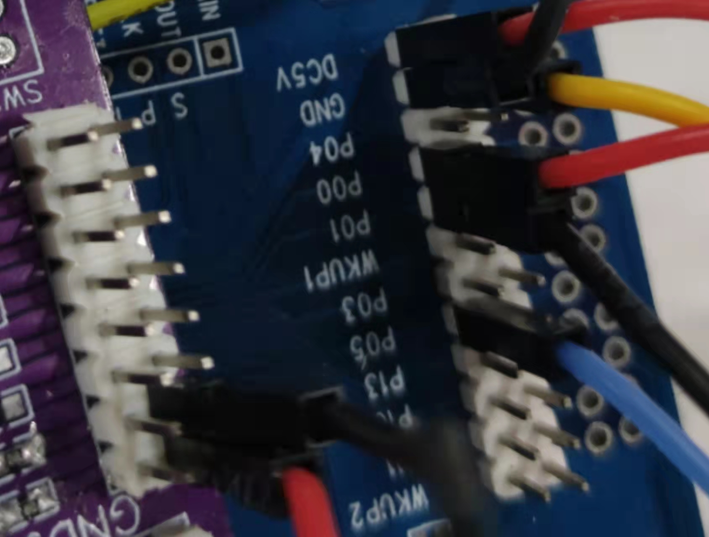

# 1. 功能说明
使用Systick产生 阻塞式延时/非阻塞式心跳节拍(时基)，初始化Systick函数及Systick中断使用。

# 2. 实现步骤

systick_init()函数中，通过P0MOD寄存器将P00,P1设置为输出模式。 通过RCCON寄存器使能HIRC,等待时钟稳定。通过TICKCON设置周期并使能Systick。通过INTEN2寄存器使能Systick中断。通过INTEN0使能全局中断。

声明两个变量用以作为开启延时的标志和记录进入中断次数，在中断服务函数中反转P00，并在标志置1时计数值自加1。在systick_delay()函数中，调用时标志置1，并等待计数，结束后清除两个变量。 

# 3. 代码编译

## 3.1 PlatformIO IDE

### 3.1.1 参考如下链接，搭建PlatformIO IDE的开发环境

http://www.sinhmicro.com.cn/index.php/more/blog/vscode-platformio-sinh51

### 3.1.2 在PlatformIO IDE中打开工程并编译

和其它示例基本一致，不再详细说明，具体请参考：

[led-blink/doc/readme.md](../../led-blink/doc/readme.md)

## 3.2 Keil C51 IDE

### 3.2.1 参考如下链接，搭建Keil C51 IDE的开发环境

http://www.sinhmicro.com/index.php/tool/software/debugger/sinh51_keil

### 3.2.2 在Keil C51 IDE中打开工程并编译

和其它示例基本一致，不再详细说明，具体请参考：

[led-blink/doc/readme.md](../../led-blink/doc/readme.md)

# 4. 测试步骤

## 4.1 通过模拟器测试
### 4.1.1 PlatformIO IDE

暂不支持。

### 4.1.2 Keil C51 IDE

1. 编译工程。
2. 打开"Option-->Debug"界面。
3. 配置工程的调试选项为模拟器。
4. 启动调试。
5. 在“Peripherals”标签中打开I/O模拟器。
6. 运行代码，通过I/O或LED模拟器观察执行效果。
7. 可自行修改delay时间和systick周期，观察 I/O p00,p01的闪烁频率变化

## 4.2 通过开发板测试

### 4.2.1 参考如下链接，进行硬件连接

http://sinhmicro.com/index.php/tool/hardware/debugger/ssd8

（使用杜邦线：将开发板的p00和p01分别连接至拓展版的LED1,LED2排针上，并将开发板的GND与拓展版的GND相连。）

### 4.2.2 通过Flash_Tools烧录固件

和其它示例基本一致，不再详细说明，具体请参考：

[led-blink/doc/readme.md](../../led-blink/doc/readme.md)

### 4.2.3 硬件调试

1. 使用USB B连接线将调试器与PC连接起来。
2. 点击Flash烧录软件，芯片状态下的“连接按钮”。
3. 观察LED灯闪烁状态

