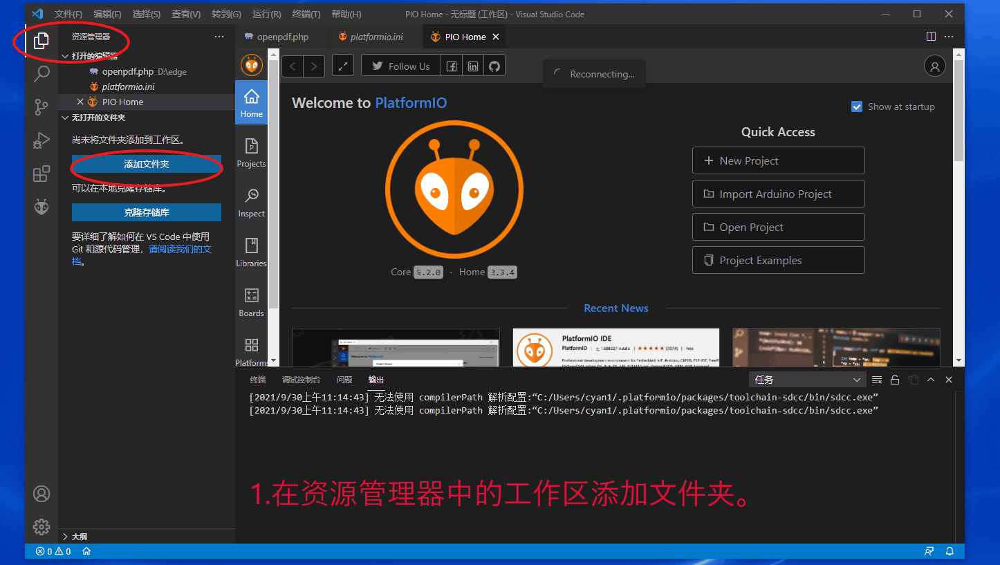
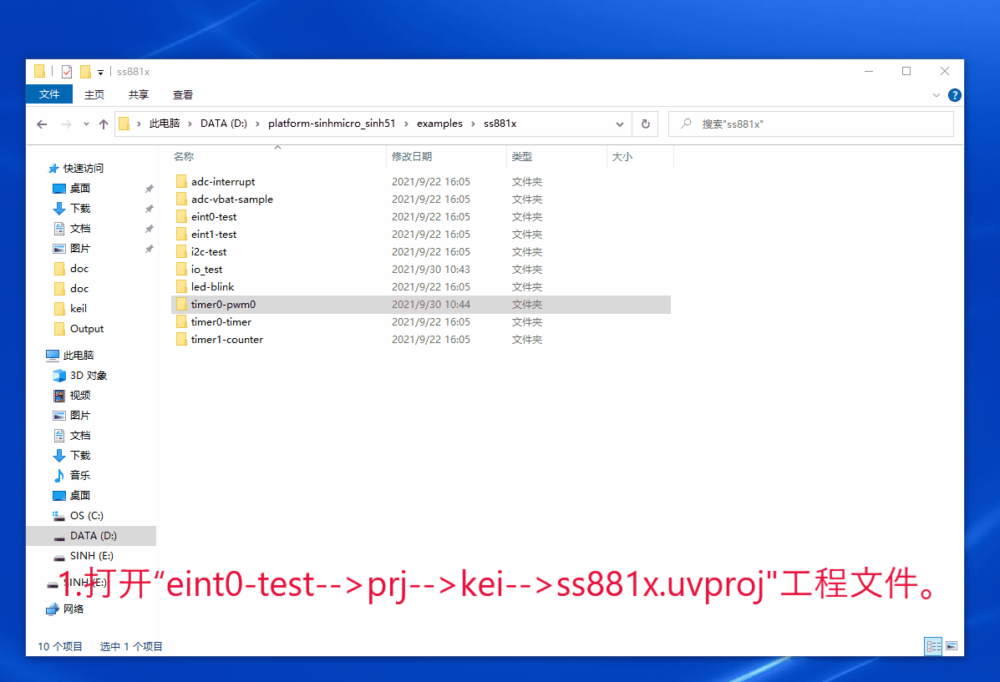
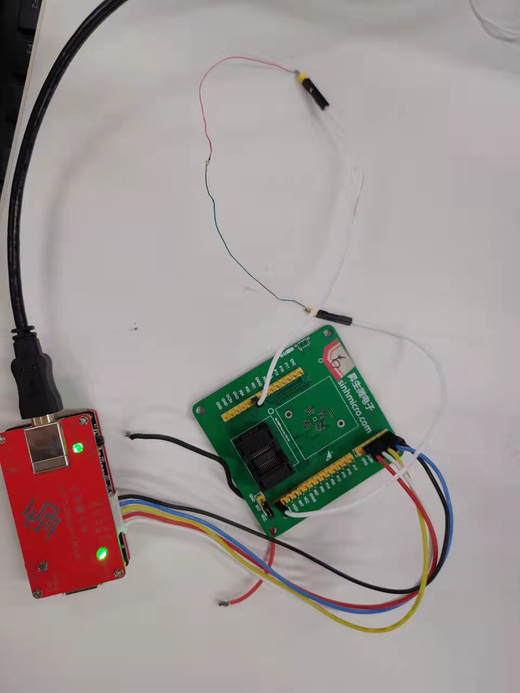
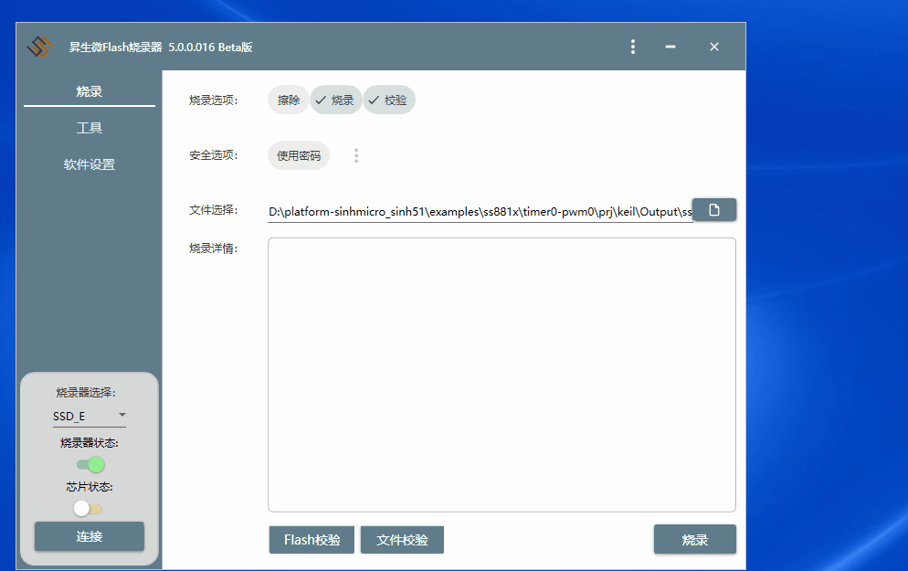

# 1. 功能说明
通过改变PWM0的占空比，改变LED灯的亮度。

# 2. 功能实现

通过配置MFP0和TCON1寄存器把P00作为PWM0输出，并配置为高电平驱动。

通过配置TMOD将定时器0工作在方式2，设定TL0和TH0初值将定时器的溢出时间设置为100ms，同时溢出时间也为PWM0的周期。

通过使用定时器0的中断功能使PWM0的占空比每秒改变一次，并在0~100%之间变化。此时会看到LED灯的亮度每秒改变一次，并在最小亮度和最大亮度之间变化。

# 3. 代码编译

## 3.1 PlatformIO IDE

### 3.1.1 参考如下链接，搭建PlatformIO IDE的开发环境

http://www.sinhmicro.com.cn/index.php/more/blog/vscode-platformio-sinh51

### 3.1.2 在PlatformIO IDE中打开工程并编译

1. 在资源管理器中的工作区添加文件夹。
2. 将”timer0-pwm0“文件添加到工件区。
3. 点击PlatformIO的图标，找到“PROJECT TASKS”标签。
4. 点击"Build"按钮，编译工程。
5. “.pio\build\ss881a”目录中生成非加密的二进制文件。

## 3.2 Keil C51 IDE

### 3.2.1 参考如下链接，搭建Keil C51 IDE的开发环境

http://www.sinhmicro.com/index.php/tool/software/debugger/sinh51_keil

### 3.2.2 在Keil C51 IDE中打开工程并编译

1. 打开“eint0-test-->prj-->kei-->ss881x.uvproj"工程文件。
4. 点击编译按钮，编译工程。
3. 生成”ss881x.bin"非加密固件和”ss881x_fw.bin"加密固件。
7. 编译生成的固件位于“Output”目录中。

# 4. 测试步骤

## 4.1 通过模拟器测试
### 4.1.1 PlatformIO IDE

暂不支持。

### 4.1.2 Keil C51 IDE
暂不支持。
## 4.2 通过开发板测试

### 4.2.1 参考如下链接，进行硬件连接

http://sinhmicro.com/index.php/tool/hardware/debugger/ssd8

### 4.2.2 通过Flash_Tools烧录固件

1. 打开Flash_Tools工具。
2. 点击“连接”按钮。
3. 选择相应的固件,固件位于“Output”目录中。
4. 点击“烧录”按钮，查看烧录状态。

### 4.2.3 硬件调试

1. 使用USB B连接线将调试器与PC连接起来。

2. 点击Flash烧录软件，芯片状态下的“连接按钮”。

3. 这里选择P00引脚为PWM0输出，将LED灯正极接在P00，负极接地。

4. 由于PWM的占空比每秒中改变一次，从0增加到100%，所以会看到LED灯的亮度每秒变化一次，且亮度逐渐增加，然后循环往复。
