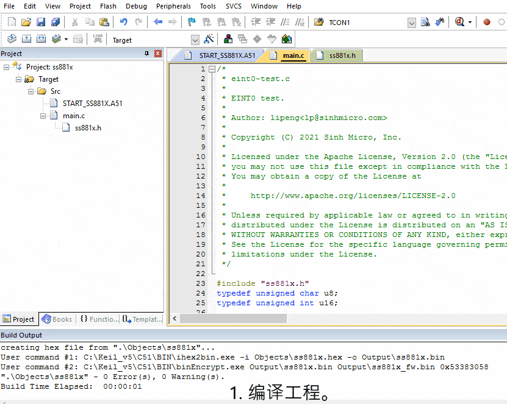
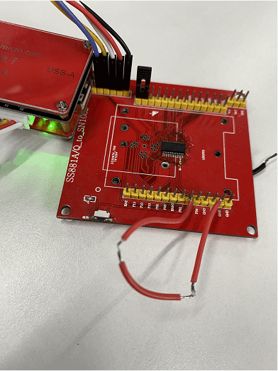

# 1. 功能说明
使用定时器0（Timer0）触发中断，使P00每隔1s状态翻转一次，硬件实现LED每隔1s闪烁一次。

# 2. 功能实现

配置TMOD寄存器，使用定时器0（Timer0），工作方式2（8位自动重载），TCON1寄存器配置定时器0时钟为系统时钟的6分频（TCLK0=SCLK/2=2MHz ）。

计算TL0=0X38,TH0=0X38,即每100us定时器0溢出一次，在中断服务中，累计溢出10000次，P00翻转一次，即1s翻转一次。

# 3. 代码编译

## 3.1 PlatformIO IDE

### 3.1.1 参考如下链接，搭建PlatformIO IDE的开发环境

http://www.sinhmicro.com.cn/index.php/more/blog/vscode-platformio-sinh51

### 3.1.2 在PlatformIO IDE中打开工程并编译

和其它示例基本一致，不再详细说明，具体请参考：

## 3.2 Keil C51 IDE

### 3.2.1 参考如下链接，搭建Keil C51 IDE的开发环境

http://www.sinhmicro.com/index.php/tool/software/debugger/sinh51_keil

### 3.2.2 在Keil C51 IDE中打开工程并编译

和其它示例基本一致，不再详细说明，具体请参考：

# 4. 测试步骤

## 4.1 通过模拟器测试
### 4.1.1 PlatformIO IDE

暂不支持。

### 4.1.2 Keil C51 IDE

1. 编译工程。
2. 打开"Option-->Debug"界面。
3. 配置工程的调试选项为模拟器。
4. 启动调试。
5. 在“Peripherals”标签中打开I/O模拟器。
6. 在SCOPE下，选择P00。
7. 运行代码，通过I/O或LED模拟器观察执行效果。
8. 观察P00频率和周期，F=0.50Hz,P=2.00s。

## 4.2 通过开发板测试

### 4.2.1 参考如下链接，进行硬件连接

http://sinhmicro.com/index.php/tool/hardware/debugger/ssd8

### 4.2.2 通过Flash_Tools烧录固件

和其它示例基本一致，不再详细说明，具体请参考：

### 4.2.3 硬件调试

1. 使用USB B连接线将调试器与PC连接起来。

2. 点击Flash烧录软件，芯片状态下的“连接按钮”。

3. 可以观察到LED闪烁频率为1s(可以使用示波器自行测试，这里不再赘述。)。

