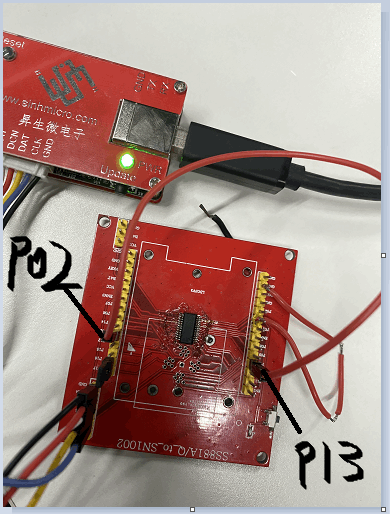
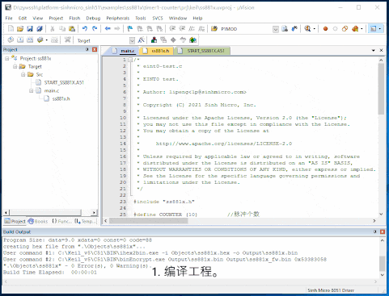

# 1. 功能说明
使用定时器1（Timer1），工作在计数模式，计数P13引脚的脉冲个数（从高电平到低电平为一个有效脉冲）。

# 2. 实现步骤

1. 使用TMOD寄存器配置定时器1（Timer1）为计数方式，工作在模式0（13位计数器/定时器）。
2. 给定时器1（Timer1）设定初值，这里设置TH1=0X00;TL1=0X00；（注意TL1只使用低5位，高3位是不确定的）。
3. 通过MFP2寄存器复用P13为T1。
4. 在硬件上用杜邦线将P02连接到P13，通过P02输出高低电平来给P13提供有效脉冲。

# 3. 代码编译

## 3.1 PlatformIO IDE

### 3.1.1 参考如下链接，搭建PlatformIO IDE的开发环境

http://www.sinhmicro.com.cn/index.php/more/blog/vscode-platformio-sinh51

### 3.1.2 在PlatformIO IDE中打开工程并编译

和其它示例基本一致，不再详细说明，具体请参考：

[led-blink/doc/readme.md](../../led-blink/doc/readme.md)

## 3.2 Keil C51 IDE

### 3.2.1 参考如下链接，搭建Keil C51 IDE的开发环境

http://www.sinhmicro.com/index.php/tool/software/debugger/sinh51_keil

### 3.2.2 在Keil C51 IDE中打开工程并编译

和其它示例基本一致，不再详细说明，具体请参考：

[led-blink/doc/readme.md](../../led-blink/doc/readme.md)

# 4. 测试步骤

## 4.1 通过模拟器测试
### 4.1.1 PlatformIO IDE

暂不支持。

### 4.1.2 Keil C51 IDE
不支持计数调试，只支持定时调试。

## 4.2 通过开发板测试

### 4.2.1 参考如下链接，进行硬件连接

http://sinhmicro.com/index.php/tool/hardware/debugger/ssd8

### 4.2.2 通过Flash_Tools烧录固件

和其它示例基本一致，不再详细说明，具体请参考：

[led-blink/doc/readme.md](../../led-blink/doc/readme.md)

### 4.2.3 通过在线调试查看计数效果

1. 编译工程。
2. 打开"Option-->Debug"界面。
3. 配置工程的调试选项为调试器。
4. 打开Flash软件，烧录固件，连接芯片。
5. 启动调试。
6. 点击Watch1,把TL1和TH1添加到Watch1下，查看这两个寄存器的值。
7. 运行代码，查看TL1和TH1的值是否为有效脉冲个数。

