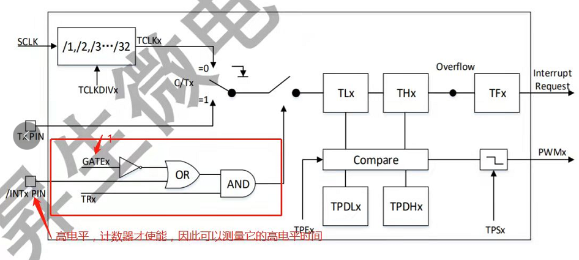
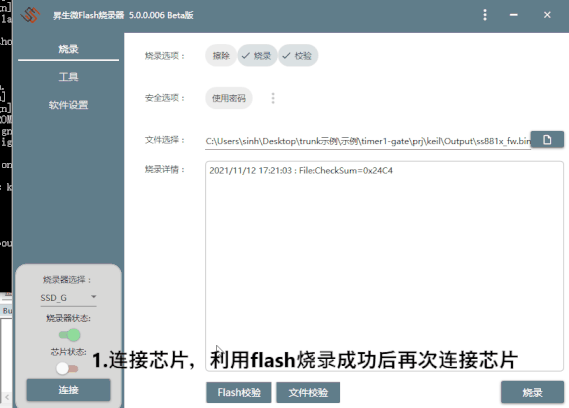
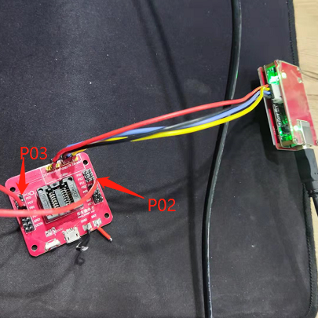

# 1. 功能说明
SS881X芯片的定时/计数器1可以测量外部EINTx引脚上正脉冲信号，实现方式为使能GATEx位，再通过外部EINTx引脚输入1，这样可以测量EINTx引脚上正脉冲信号宽度。具体电路图如图所示：

本例程通过配置P03为EINT1，由P02输出高电平1为正脉冲信号，输入到P03，从而测出该脉冲宽度。

# 2. 实现步骤

1. 配置SCLK为高频，12MHz，分频系数为6，
2. 通过TMOD寄存器配置定时器1（Timer1）为计数器，工作方式为方式1（16位向上计数），打开GATE1,并给TL1和TH1赋初值0，开启TR1；
3. 配置P03为EINT1，输入模式，作为脉冲接入EINT1引脚，当EINT1接收到高电平时，定时计数器开始计数；
4. 配置P02为输出模式，输出一个高电平，将这个高电平输出给P03；
5. 在开发板硬件上用杜邦线将P02连接到P03，通过P02输出高电平来给P03。

# 3. 代码编译

## 3.1 PlatformIO IDE

### 3.1.1 参考如下链接，搭建PlatformIO IDE的开发环境

http://www.sinhmicro.com.cn/index.php/more/blog/vscode-platformio-sinh51

### 3.1.2 在PlatformIO IDE中打开工程并编译

和其它示例基本一致，不再详细说明，具体请参考：

[led-blink/doc/readme.md](../../led-blink/doc/readme.md)

## 3.2 Keil C51 IDE

### 3.2.1 参考如下链接，搭建Keil C51 IDE的开发环境

http://www.sinhmicro.com/index.php/tool/software/debugger/sinh51_keil

### 3.2.2 在Keil C51 IDE中打开工程并编译

和其它示例基本一致，不再详细说明，具体请参考：

[led-blink/doc/readme.md](../../led-blink/doc/readme.md)

# 4. 测试步骤

## 4.1 通过模拟器测试
### 4.1.1 PlatformIO IDE

暂不支持。

### 4.1.2 Keil C51 IDE
暂不支持

## 4.2 通过开发板测试

### 4.2.1 参考如下链接，进行硬件连接

1.通过SSD8调试器连接开发板硬件电路和PC端，烧录程序后连接芯片；

2.打开keil，选择硬件调试；

3.运行工程，可以看到计数值，即脉冲宽度。

### 4.2.2 通过Flash_Tools烧录固件

和其它示例基本一致，不再详细说明，具体请参考：

[led-blink/doc/readme.md](../../led-blink/doc/readme.md)

### 4.2.3 硬件调试

实际硬件电路搭配如图所示：通过P02输出高电平给P03，定时/计数器1开始计数脉冲。利用SSD8调试器连接开发板和PC端，再用keil工具硬件仿真调试查看计数值。

