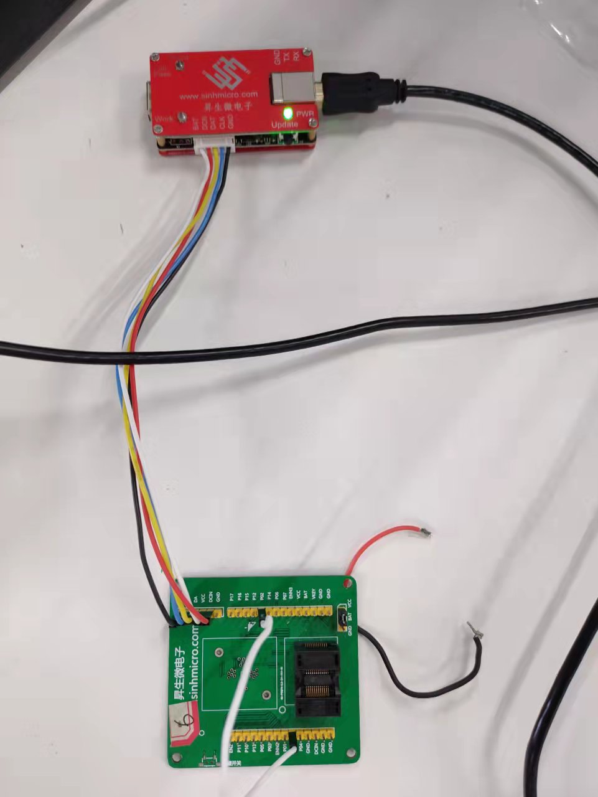

# 1. 功能说明
​	用定时器0工作在方式2发出PWM0波形，使其从P00口输出。利用定时器2的捕获功能测量P00输出波形的频率。

# 2. 功能实现

- 配置TMOD寄存器，使定时器0工作在方式2（8位自动重载），TCON1寄存器配置定时器0时钟为系统时钟的6分频（TCLK0=SCLK/2=2MHz ）。计算定时器初值TL0=0X38（装载值决定着PWM0的频率，为了严谨设定初值，不设置也可以）装载值TH0=0X38，TPDL0 = 0x9c，使PWM0的频率为10000HZ，空占比为50%。同时使P00作为PWM0的输出口。

- 配置T2MOD寄存器，使定时器2的TCCM0工作在捕获功能，T2CON寄存器配置定时器0时钟为系统时钟的6分频（TCLK0=SCLK/2=2MHz ），则此时定时器2数据寄存器每次增加1用时0.5 us。计算定时器初值TL2= 0xc0，TH2_0 = 0x00，TH2_1= 0x00（同理，为了严谨设定初值），装载值TRL2= 0xc0，TRH2_0 = 0x00，TRH2_1= 0x00，即定时器2的频率为250HZ。同时使P02作为CC0的输入口。

- 每次P02捕获到上升沿时，定时器2当前数据寄存器中的值将加载到TCC0L和TCC0H中，并将TCC0L和TCC0H的值放到tcc[10]数组中（共采集10次），则此时PWM0波的频率（单位HZ）：
  $$
  (2 * 10^6)/(tcc[j+1]-tcc[j])
  $$
  将计算结果放到cycle[9]中。

# 3. 代码编译

## 3.1 PlatformIO IDE

### 3.1.1 参考如下链接，搭建PlatformIO IDE的开发环境

http://www.sinhmicro.com.cn/index.php/more/blog/vscode-platformio-sinh51

### 3.1.2 在PlatformIO IDE中打开工程并编译

和其它示例基本一致，不再详细说明，具体请参考：

[led-blink/doc/readme.md](../../led-blink/doc/readme.md)

## 3.2 Keil C51 IDE

### 3.2.1 参考如下链接，搭建Keil C51 IDE的开发环境

http://www.sinhmicro.com/index.php/tool/software/debugger/sinh51_keil

### 3.2.2 在Keil C51 IDE中打开工程并编译

和其它示例基本一致，不再详细说明，具体请参考：

[led-blink/doc/readme.md](../../led-blink/doc/readme.md)

# 4. 测试步骤

## 4.1 通过模拟器测试
### 4.1.1 PlatformIO IDE

暂不支持。

### 4.1.2 Keil C51 IDE
暂不支持。

## 4.2 通过开发板测试

### 4.2.1 参考如下链接，进行硬件连接

http://sinhmicro.com/index.php/tool/hardware/debugger/ssd8

### 4.2.2 通过Flash_Tools烧录固件

和其它示例基本一致，不再详细说明，具体请参考：

[led-blink/doc/readme.md](../../led-blink/doc/readme.md)

### 4.2.3 硬件调试

1. 在开发板上将P00与P02用线连接起来，此时PWM0波形将输出到CC0中。
2. 使用USB B连接线将调试器与PC连接起来。
3. 点击Flash烧录软件，芯片状态下的“连接按钮”。
4. 在keil C51上点击调试。
5. 将cycle数组添加到Watch1窗口中（选中cycle—右键—add ‘cycle’ to），运行停止后cycle中的数都为0x2710=10000HZ，与预期相符。

