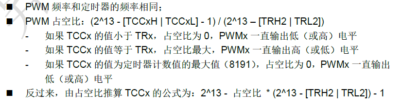
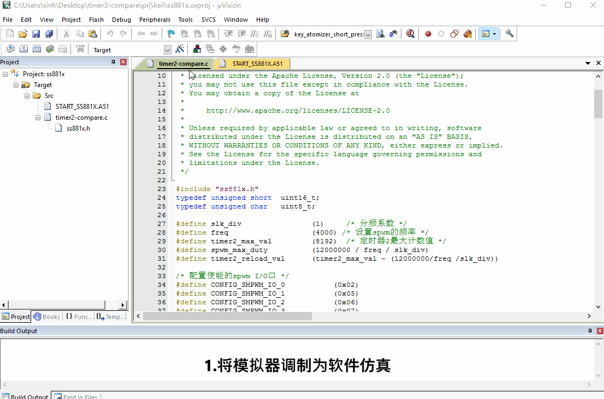

# 1. 功能说明
SS881X系列芯片的定时器2是可自动重载的13位定时器，本例程利用定时器2输出smart pwm信号，定时器2的 CC0到3输出频率相同占空比不通的PWM，通过设置固定频率为4000，调duty0到3 输出对应CC0到3不同的占空比，duty范围是0到3000

# 2. 实现步骤

1.设置SCLK和分频系数，该例程配置CLKCON0 为12M时钟源， T2CON分频系数为1，同时将TR2置1，打开定时器2。

2.设置spwm的固定频率：

(1)计算频率的公式为：频率 = 2^13 －SCLK频率 / 想要获得的spwm频率 / 分频系数；(即重载值)

(2)将得到的值低8位放入TRL2，高位中的bit8到bit10放入TRH0,bit11和bit12放入TRH1，一共正好13位；

3.设置spwm的占空比：

(1)当想获得最大占空比100%时，比较值为定时器2的重载值；

 当想获得最小占空比0%时，比较值为定时器2的最大计数值；

 当想获得0%到100%时，比较值的计算公式为：2^13 - 重载值，本例程duty的范围为0~3000；

(2) 将得到duty0到3的占空值的分别放入TCC0到3L和TCC0到3H中，当TL2/TH2的值计数到和TCCxL/TCCxH的值相等的时候，会在CCx引脚发生电平翻转；

4.配置并使能相应的spwm I/O口，本例程是将P02、P05、P06、P07分别配置为CC0、CC1、CC2、CC3。

# 3. 代码编译

## 3.1 PlatformIO IDE

### 3.1.1 参考如下链接，搭建PlatformIO IDE的开发环境

http://www.sinhmicro.com.cn/index.php/more/blog/vscode-platformio-sinh51

### 3.1.2 在PlatformIO IDE中打开工程并编译

和其它示例基本一致，不再详细说明，具体请参考：

[led-blink/doc/readme.md](../../led-blink/doc/readme.md)

## 3.2 Keil C51 IDE

### 3.2.1 参考如下链接，搭建Keil C51 IDE的开发环境

http://www.sinhmicro.com/index.php/tool/software/debugger/sinh51_keil

### 3.2.2 在Keil C51 IDE中打开工程并编译

和其它示例基本一致，不再详细说明，具体请参考：

[led-blink/doc/readme.md](../../led-blink/doc/readme.md)

# 4. 测试步骤

## 4.1 通过模拟器测试
### 4.1.1 PlatformIO IDE

暂不支持。

### 4.1.2 Keil C51 IDE

1.编译并运行工程；

2.观察pwm的输出频率；

3.观察CC0~CC3输出的占空比。

## 4.2 通过开发板测试

### 4.2.1 参考如下链接，进行硬件连接

http://sinhmicro.com/index.php/tool/hardware/debugger/ssd8

### 4.2.2 通过Flash_Tools烧录固件

和其它示例基本一致，不再详细说明，具体请参考：

[led-blink/doc/readme.md](../../led-blink/doc/readme.md)

### 4.2.3 硬件调试

可以通过示波器观察P02、P05、P06、P07的输出占空比，这里不再做演示。

