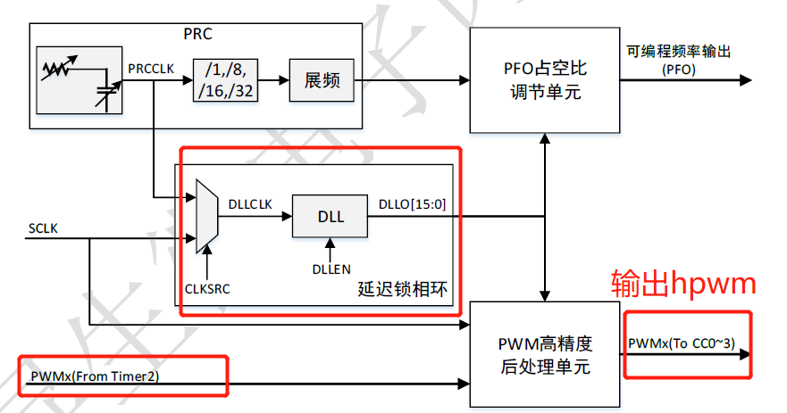
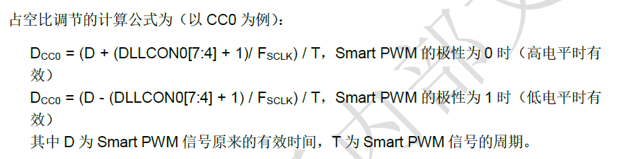
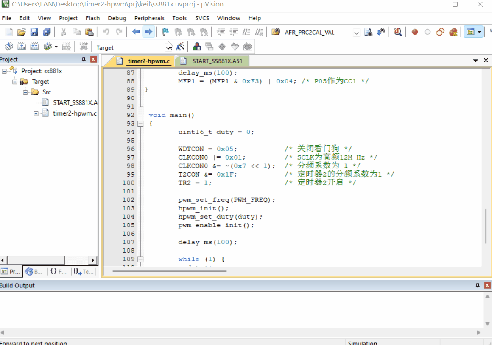

# 1. 功能说明
SS881X系列芯片包含一个占空比16档可调可编程信号产生单元（PFOU），电路图如下所示：

本例程是通过配置P05为CC1，开启高精度pwm处理后，占空比可调的范围更加精细，通过每次增加duty的值，使得占空比增加，即当TL2/TH2的值计数到和TCC1L/TCC1H的值相等的时候，会在CC1引脚发生电平翻转。

# 2. 实现步骤

1. 关闭看门狗，开启高频，分频系数为1，TR2置1，开启定时计数器2；
2. 设置PWM的频率，计算公式：频率 = TCLK^13 - [2^13 - [TRH2|TRL2]，因此寄存器的装载值 = 2^13 - TCLK / 频率，将得到的装载值放入TRL2和TRH2寄存器中；
3. 高精度PWM设置，配置CLKCON1寄存器，使能PFOU时钟，来源为SCLK，DDL频率范围为4M到12M Hz（具体要根据时钟源配置），配置HPWMCON0寄存器，使能高精度PWM CC1；
4. 设置占空比，从0开始，占空比微调的时间单位是1/Fsclk，共可调整16级，占空比的调节公式如下：

5. pwm使能设置，配置T2MOD，CC1开启比较功能，配置MFP1，P05作为CC1；
6. 在while（1）循环里面每隔一段时间增加duty的值，改变占空比，当达到最大值时，复位置0.

# 3. 代码编译

## 3.1 PlatformIO IDE

### 3.1.1 参考如下链接，搭建PlatformIO IDE的开发环境

http://www.sinhmicro.com.cn/index.php/more/blog/vscode-platformio-sinh51

### 3.1.2 在PlatformIO IDE中打开工程并编译

和其它示例基本一致，不再详细说明，具体请参考：

[led-blink/doc/readme.md](../../led-blink/doc/readme.md)

## 3.2 Keil C51 IDE

### 3.2.1 参考如下链接，搭建Keil C51 IDE的开发环境

http://www.sinhmicro.com/index.php/tool/software/debugger/sinh51_keil

### 3.2.2 在Keil C51 IDE中打开工程并编译

和其它示例基本一致，不再详细说明，具体请参考：

[led-blink/doc/readme.md](../../led-blink/doc/readme.md)

# 4. 测试步骤

## 4.1 通过模拟器测试
### 4.1.1 PlatformIO IDE

暂不支持。

### 4.1.2 Keil C51 IDE

1.编译并运行工程；

2.打开PWM调试窗口，运行工程；

3.观察CC1占空比的增加值，可以发现经过高精度处理后，PWM的占空比更加精细。

## 4.2 通过开发板测试

### 4.2.1 参考如下链接，进行硬件连接

http://sinhmicro.com/index.php/tool/hardware/debugger/ssd8

### 4.2.2 通过Flash_Tools烧录固件

和其它示例基本一致，不再详细说明，具体请参考：

[led-blink/doc/readme.md](../../led-blink/doc/readme.md)

### 4.2.3 硬件调试

暂不支持。

