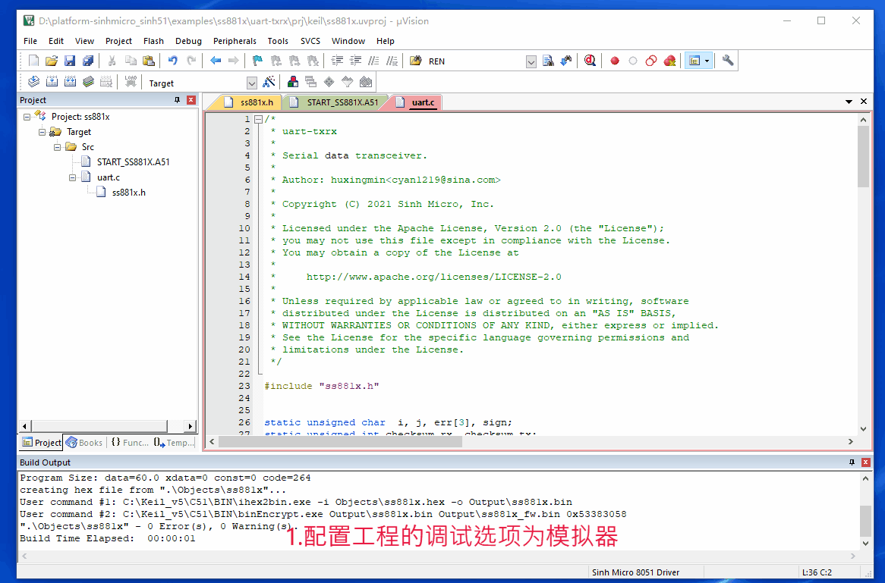
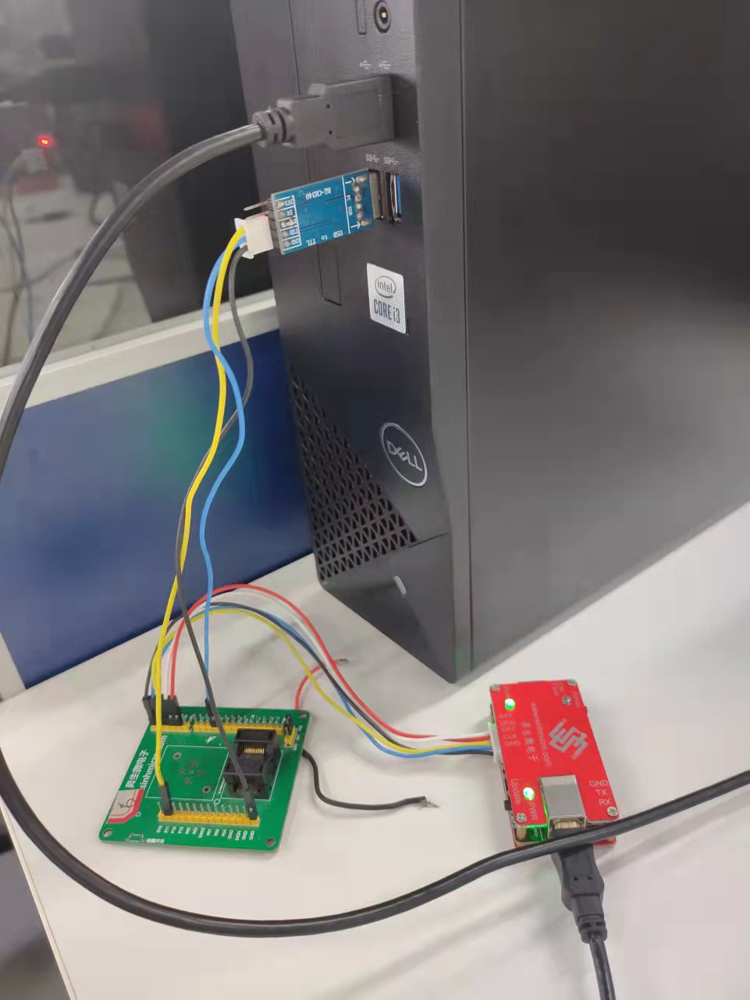
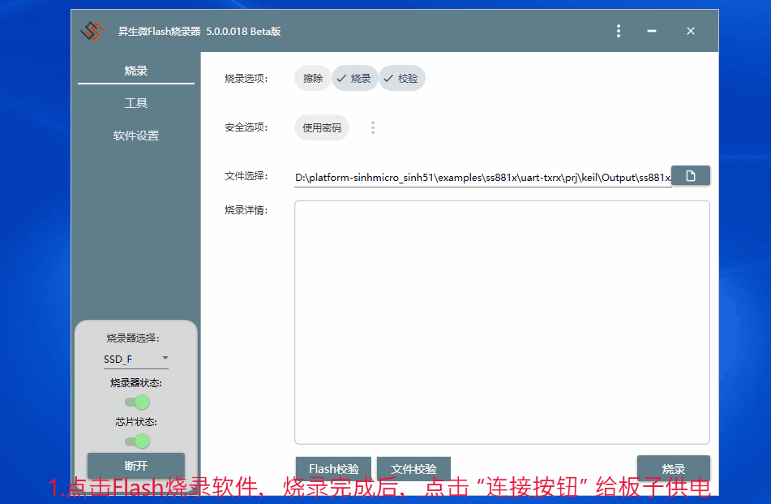

# 1. 功能说明
​		串口数据的收发。

# 2. 功能实现

- 配置SCON寄存器和SBR寄存器，使串口工作在波特率为460800的收发状态。

- 时刻接收数据并放到数组a[20]中，当出现结束标志sign（0XFE）时，停止接收。将收到的校验和 a[i-1] 与自己计算得到的校验和(checksum_rx )比较，如果相等，说明收到的数据正确，则将数据发送出去，并发送校验和checksum_tx和结束标志sign。如果不相等，说明收到的数据有误，则发送err提示信息。

  **注意：约定数据格式为数据+校验和+结束标志，并规定校验和为各个数据数值相加。**

# 3. 代码编译

## 3.1 PlatformIO IDE

### 3.1.1 参考如下链接，搭建PlatformIO IDE的开发环境

http://www.sinhmicro.com.cn/index.php/more/blog/vscode-platformio-sinh51

### 3.1.2 在PlatformIO IDE中打开工程并编译

和其它示例基本一致，不再详细说明，具体请参考：

[led-blink/doc/readme.md](../../led-blink/doc/readme.md)

## 3.2 Keil C51 IDE

### 3.2.1 参考如下链接，搭建Keil C51 IDE的开发环境

http://www.sinhmicro.com/index.php/tool/software/debugger/sinh51_keil

### 3.2.2 在Keil C51 IDE中打开工程并编译

和其它示例基本一致，不再详细说明，具体请参考：

[led-blink/doc/readme.md](../../led-blink/doc/readme.md)

# 4. 测试步骤

## 4.1 通过模拟器测试
### 4.1.1 PlatformIO IDE

暂不支持。

### 4.1.2 Keil C51 IDE

1. 配置工程的调试选项为模拟器。
2. 编译工程，打开"Option-->Debug"界面。
3. 启动调试，打开serial窗口，选中Send和Receive窗口下的HEX，使其16位进制显示。
4. 在Send窗口里写01 02 03 FE，看到Receive窗口下收到01 02 03 FE（前两个是数据，第三位是校验和为03（01+02 = 03 ），当自己计算得到的校验和(checksum_rx )与收到的校验和相等，将数据发送出去）。
5. 在Send窗口里写01 02 02 FE，看到Receive窗口下收到err（同理，自己计算得到的校验和(checksum_rx  = 03)，与收到的校验和（a[i - 1] = 02）不相等，所以发送err）。

## 4.2 通过开发板测试

### 4.2.1 参考如下链接，进行硬件连接

http://sinhmicro.com/index.php/tool/hardware/debugger/ssd8

1. 在开发板上将P11，P12和GND与USB数据转串口的RX口，TX口和GND用线分别连接起来。

### 4.2.2 通过Flash_Tools烧录固件

和其它示例基本一致，不再详细说明，具体请参考：

[led-blink/doc/readme.md](../../led-blink/doc/readme.md)

### 4.2.3 硬件调试

1. 使用USB B连接线将调试器与PC连接起来，并将USB数据转串口与PC连接起来。
2. 点击Flash烧录软件，烧录完成后，点击 “连接按钮” 给板子供电。
4. 打开XCOM V2.6软件（关闭杀毒软件），在串口选择处修改参数（其中：COM6:USB-SERIAL不同电脑对USB数据转接头识别出的名字不一样，根据实际选择），打开串口。
5. 在发送窗口里写01 02 03 FE，看到接收窗口下收到01 02 03 FE（选中16进制显示）。
6. 在发送窗口里写01 02 02 FE，看到Receive窗口下收到err（选中16进制显示）。

