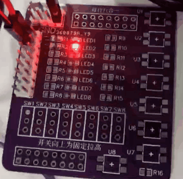

# 1. 功能说明
​	使用看门狗防止程序跑飞。

# 2. 功能实现

​    首先配置看门狗是否在空闲模式运行，其次设置看门狗超时时间，这里可以设置的范围是125ms-8s。

​    在运行时通过RESETS寄存bit7置一进行计数清0（喂狗）。如果程序出现意外，可在复位后读取RESETS第4位判断是否出现了异常并作出处理。

# 3. 代码编译

## 3.1 PlatformIO IDE

### 3.1.1 参考如下链接，搭建PlatformIO IDE的开发环境

http://www.sinhmicro.com.cn/index.php/more/blog/vscode-platformio-sinh51

### 3.1.2 在PlatformIO IDE中打开工程并编译

和其它示例基本一致，不再详细说明，具体请参考：

[led-blink/doc/readme.md](../../led-blink/doc/readme.md)

## 3.2 Keil C51 IDE

### 3.2.1 参考如下链接，搭建Keil C51 IDE的开发环境

http://www.sinhmicro.com/index.php/tool/software/debugger/sinh51_keil

### 3.2.2 在Keil C51 IDE中打开工程并编译

和其它示例基本一致，不再详细说明，具体请参考：

[led-blink/doc/readme.md](../../led-blink/doc/readme.md)

# 4. 测试步骤

## 4.1 通过模拟器测试
### 4.1.1 PlatformIO IDE

暂不支持。

### 4.1.2 Keil C51 IDE
暂不支持。

## 4.2 通过开发板测试

### 4.2.1 参考如下链接，进行硬件连接

http://sinhmicro.com/index.php/tool/hardware/debugger/ssd8

### 4.2.2 通过Flash_Tools烧录固件

和其它示例基本一致，不再详细说明，具体请参考：

[led-blink/doc/readme.md](../../led-blink/doc/readme.md)

### 4.2.3 硬件调试

1. 使用USB B连接线将调试器与PC连接起来。

2. 点击Flash烧录软件，芯片状态下的“连接按钮”。

3. 将P00和P01分别连接到两个LED上

   

     P01的LED首先会反转状态20次，并且进行喂狗，这里只有P01会闪烁

   4.20次闪烁过后，主逻辑中不在进行喂狗，当看门狗超时引起复位后，判断到RESETS bit4 是1，代表上次复位由看门狗引起，此时P00闪烁两次。

   

   ​													可以观察到P00LED闪烁两次后P01正常闪烁
