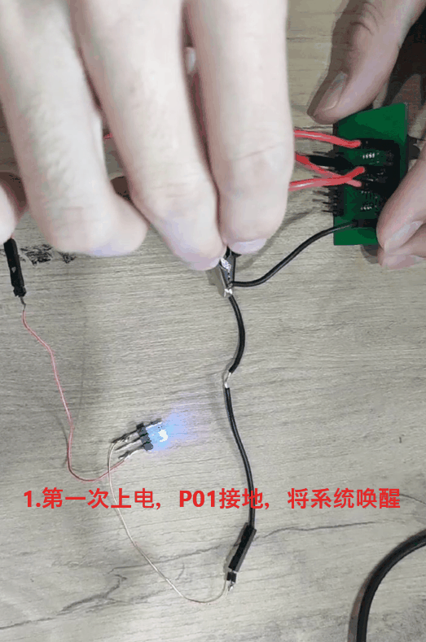
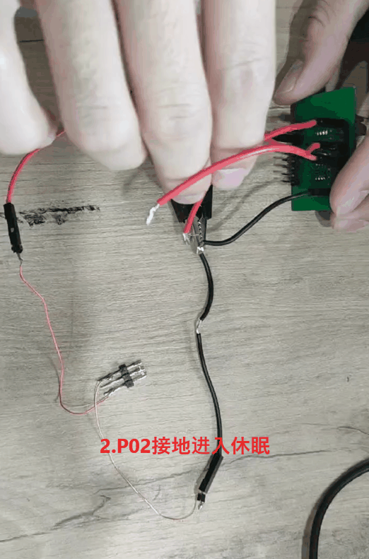
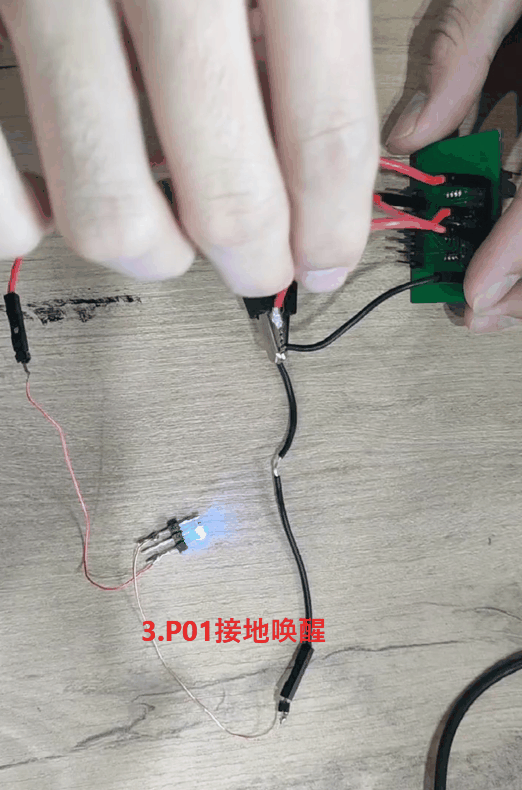

# 1. 功能说明
从正常模式进入休眠状态，休眠模式高频低频都被自动关闭，引脚上的WKUP功能被自动使能，可以通过I/O口WKUP唤醒源唤醒。本例程是通过P01 WKUP将系统从休眠状态唤醒，当系统从休眠状态唤醒时程序重新执行（相当于上电重启）。验证方式为程序正常执行时P02上拉，程序一直循环执行P00 = 1，当P02接地时跳出循环，进入休眠模式，系统停止运行，当被P01唤醒后，重新执行程序。

***（注：SS882x芯片第一次上电是进入休眠模式，需要进行唤醒才能正常执行程序）***

# 2. 实现步骤

1. 关闭看门狗，开启高频模式，分频系数为1；
2. 将P00和P01配置为GPIO口，并使能P00输出模式，P00输出0；
3. 开启P02上拉，配置P00输出1；
5. 配置CLKCON0 的bit7置1，系统进入休眠模式，此时系统停止运行。
5. 当 P01 引脚用线与GND连接时系统被唤醒，系统重新运行。

# 3. 代码编译

## 3.1 PlatformIO IDE

### 3.1.1 参考如下链接，搭建PlatformIO IDE的开发环境

http://www.sinhmicro.com.cn/index.php/more/blog/vscode-platformio-sinh51

### 3.1.2 在PlatformIO IDE中打开工程并编译

和其它示例基本一致，不再详细说明，具体请参考：

[led-blink/doc/readme.md](../../led-blink/doc/readme.md)

## 3.2 Keil C51 IDE

### 3.2.1 参考如下链接，搭建Keil C51 IDE的开发环境

http://www.sinhmicro.com/index.php/tool/software/debugger/sinh51_keil

### 3.2.2 在Keil C51 IDE中打开工程并编译

和其它示例基本一致，不再详细说明，具体请参考：

[led-blink/doc/readme.md](../../led-blink/doc/readme.md)

# 4. 测试步骤

## 4.1 通过模拟器测试
### 4.1.1 PlatformIO IDE

暂不支持。

### 4.1.2 Keil C51 IDE

暂不支持

## 4.2 通过开发板测试

### 4.2.1 参考如下链接，进行硬件连接

http://sinhmicro.com/index.php/tool/hardware/debugger/ssd8

### 4.2.2 通过Flash_Tools烧录固件

和其它示例基本一致，不再详细说明，具体请参考：

[led-blink/doc/readme.md](../../led-blink/doc/readme.md)

### 4.2.3 硬件调试

1. 在socket上通过模拟电池供电（第一次上电需要将P01接GND，将系统唤醒），LED灯接P00，此时LED灯亮；

2. 当P02接GND 时，系统退出P00 = 1循环，进入休眠模式，LED灯灭；

3. P02断开GND，此时灯还是灭，当P01接GND时，系统唤醒重新执行，LED灯亮。

