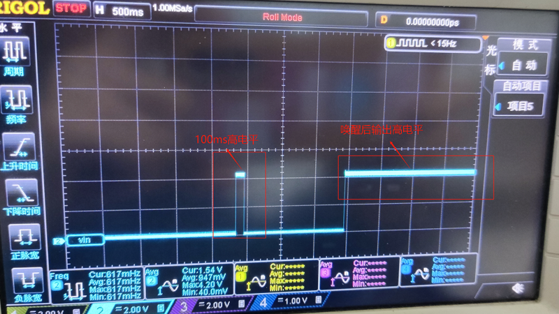

# 1. 功能说明
从正常模式进入待机状态，并通过I/O唤醒源唤醒，本例程是配置P01为唤醒源，唤醒方式为高电平唤醒。验证方式为P00先输出100ms高电平，再输出低电平，然后进入待机模式，当通过P01唤醒后P00输出高电平。

# 2. 实现步骤

1. 关闭看门狗，开启高频模式，分频系数为1；

2. 将P00和P01配置为GPIO口，并使能输出和输入模式，让P00输出100ms高电平后输出低电平；
3. 关闭所有唤醒源后，开启P01高电平唤醒同时清除pending位；
4. 延迟后关闭高频，开启低频进入stop模式；
5. 等待唤醒后，开启高频，配置P00输出高电平。

# 3. 代码编译

## 3.1 PlatformIO IDE

### 3.1.1 参考如下链接，搭建PlatformIO IDE的开发环境

http://www.sinhmicro.com.cn/index.php/more/blog/vscode-platformio-sinh51

### 3.1.2 在PlatformIO IDE中打开工程并编译

和其它示例基本一致，不再详细说明，具体请参考：

[led-blink/doc/readme.md](../../led-blink/doc/readme.md)

## 3.2 Keil C51 IDE

### 3.2.1 参考如下链接，搭建Keil C51 IDE的开发环境

http://www.sinhmicro.com/index.php/tool/software/debugger/sinh51_keil

### 3.2.2 在Keil C51 IDE中打开工程并编译

和其它示例基本一致，不再详细说明，具体请参考：

[led-blink/doc/readme.md](../../led-blink/doc/readme.md)

# 4. 测试步骤

## 4.1 通过模拟器测试
### 4.1.1 PlatformIO IDE

暂不支持。

### 4.1.2 Keil C51 IDE

暂不支持

## 4.2 通过开发板测试

### 4.2.1 参考如下链接，进行硬件连接

http://sinhmicro.com/index.php/tool/hardware/debugger/ssd8

### 4.2.2 通过Flash_Tools烧录固件

和其它示例基本一致，不再详细说明，具体请参考：

[led-blink/doc/readme.md](../../led-blink/doc/readme.md)

### 4.2.3 硬件调试

在socket上，通过模拟电池4.2V供电，P00接示波器观察波形，上电后P00输出100ms高电平，然后输出低电平，当外部给P01高电平唤醒后P00输出高电平，P00波形如下图所示：

