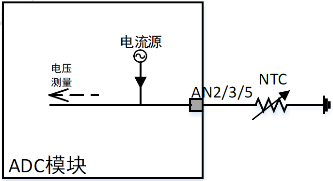
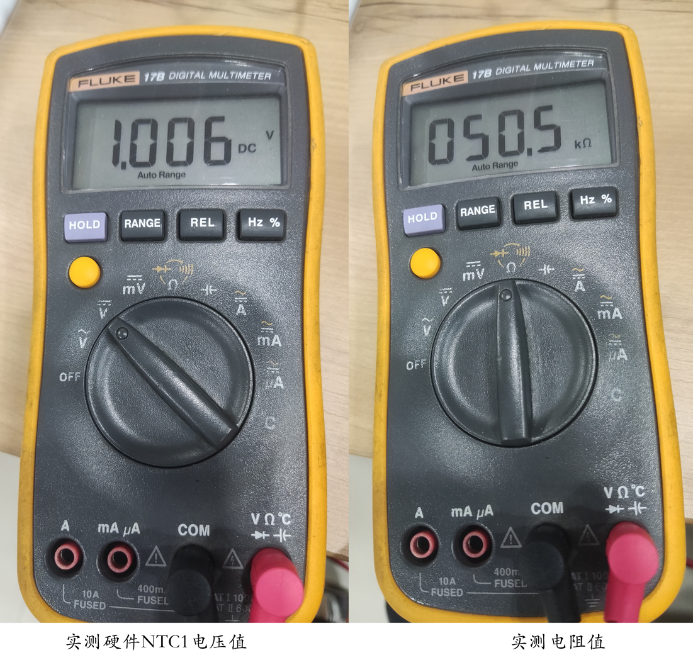

# 1. 功能说明
SS888X利用ADC模块的AN3通道，通过内部的电流源，连接外部NTC测量温度。本例程将是P01作为AN3通道，连接外部NTC测量温度。通过ADC 得到电压值，根据R(KΩ)=V(mv) /电流源档位 算出电阻值。（本例程使用普通电阻模拟热敏电阻，原理一致，热敏电阻得到阻值参照的数据查表可得到相应的温度值。）

# 2. 功能实现

ADC和时钟配置：

（1）配置MFP0寄存器将P01作为AN3通道

（2）配置CLKCON1寄存器，使能ADC（先使能ADC时钟再进行其它寄存器配置）

（3）配置ADCCON0寄存器，定义ADC为连续模式,ADC采样时钟1MHz,ADC采样后滤波求均值样本个数128

（4）配置ADCCON2，AN2通道中心电平为1500（1.5V）

（4）配置ADCCHEN寄存器使AN3通道使能

（5）配置LDOCON0寄存器的BGREN、IBIASEN位使能

（6）配置NTC1CTL，将NTC1内部电流源使能

ADC值的读取：

（1）取ADC值，将通道3低8位加上ADCDAT23H的通道3高4位组成12位；

（2）将取出的ADC值加上中心电平得到电压值。

# 3. 代码编译

## 3.1 PlatformIO IDE

和其它例程基本一致，不再详细说明，具体参考：

###### [led-blink/doc/readme.md](../../../ss881x/led-blink/doc/readme.md)

### 3.1.1 参考如下链接，搭建PlatformIO IDE的开发环境

http://www.sinhmicro.com.cn/index.php/more/blog/vscode-platformio-sinh51

### 3.1.2 在PlatformIO IDE中打开工程并编译

和其它例程基本一致，不再详细说明，具体参考：

[led-blink/doc/readme.md](../../../ss881x/led-blink/doc/readme.md)

## 3.2 Keil C51 IDE

### 3.2.1 参考如下链接，搭建Keil C51 IDE的开发环境

http://www.sinhmicro.com/index.php/tool/software/debugger/sinh51_keil

### 3.2.2 在Keil C51 IDE中打开工程并编译

和其他例程基本一致，不在详细说明，具体参考：

[led-blink/doc/readme.md](../../../ss881x/led-blink/doc/readme.md)

# 4. 测试步骤

## 4.1 通过模拟器测试
### 4.1.1 PlatformIO IDE

暂不支持。

### 4.1.2 Keil C51 IDE

暂不支持。

## 4.2 通过开发板测试

### 4.2.1 参考如下链接，进行硬件连接

http://sinhmicro.com/index.php/tool/hardware/debugger/ssd8

如图所示，P01（AN3通道）连接热敏电阻(本例程使用电阻代替)到GND

### 4.2.2 通过Flash_Tools烧录固件

和其它示例基本一致，不再详细说明，具体请参考：

[led-blink/doc/readme.md](../../../ss881x/led-blink/doc/readme.md)

### 4.2.3 硬件调试

在keil硬件调试中，根据理论 R(KΩ)=V(mv) /电流源档位，可得到计算电阻。断点显示ntc1_mv电压值和ntc1_kr理论计算电阻值，当使用热敏电阻可参考数据手册查表得到电阻对应的温度。

实际测量的电压值和实际测量的电阻值均约等于硬件调试watch1中的值。

