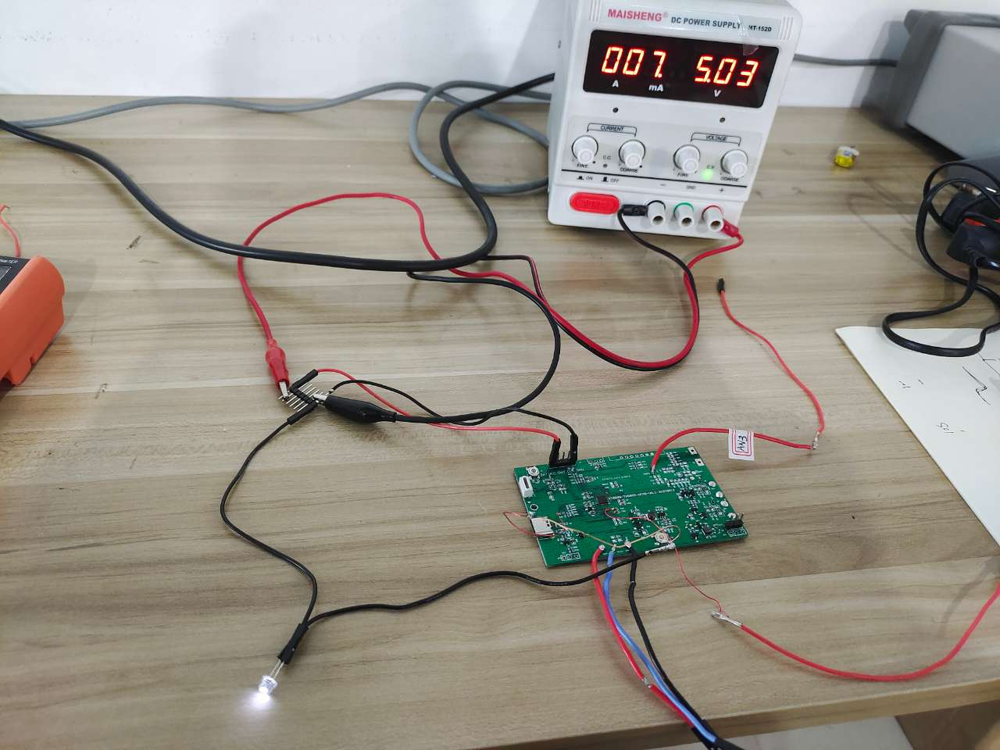

# 1. 功能说明

功能说明：通过AFR寄存器，控制P23  I/O的上拉使能，演示AFR的使用方式。

# 2. 功能实现

1. 将P23端口配置为输入模式。

2. 通过配置AFR_P2_PU寄存器使能上拉P23。

由于EFR访问有一定的延时，不能很好满足一些高速通信设备的使用，SS888X在EFR的基础上，利用间接寻址空间（IDATA）扩展出AFR寄存器（地址范围为0Xc0 ~ 0xFF）.该寄存器是通过指针间接寻址idata的（0xC0 ~ 0xFF）区域的方式在头文件中设置好了，因此在使用时只需要根据头文件中对应寄存器的地址来调用即可。

# 3. 代码编译

## 3.1 PlatformIO IDE

和其它例程基本一致，不再详细说明，具体参考：

###### [led-blink/doc/readme.md](../../../ss881x/led-blink/doc/readme.md)

### 3.1.1 参考如下链接，搭建PlatformIO IDE的开发环境

http://www.sinhmicro.com.cn/index.php/more/blog/vscode-platformio-sinh51

### 3.1.2 在PlatformIO IDE中打开工程并编译

和其它例程基本一致，不再详细说明，具体参考：

[led-blink/doc/readme.md](../../../ss881x/led-blink/doc/readme.md)

## 3.2 Keil C51 IDE

### 3.2.1 参考如下链接，搭建Keil C51 IDE的开发环境

http://www.sinhmicro.com/index.php/tool/software/debugger/sinh51_keil

### 3.2.2 在Keil C51 IDE中打开工程并编译

和其他例程基本一致，不在详细说明，具体参考：

[led-blink/doc/readme.md](../../../ss881x/led-blink/doc/readme.md)

# 4. 测试步骤

## 4.1 通过模拟器测试

### 4.1.1 PlatformIO IDE

暂不支持。

### 4.1.2 Keil C51 IDE

暂不支持。

## 4.2 通过开发板测试

### 4.2.1 参考如下链接，进行硬件连接

http://sinhmicro.com/index.php/tool/hardware/debugger/ssd8

### 4.2.2 通过Flash_Tools烧录固件

和其它示例基本一致，不再详细说明，具体请参考：

[led-blink/doc/readme.md](../../../ss881x/led-blink/doc/readme.md)

### 4.2.3 硬件调试

1. 将5V的电压源的正负极与开发板的VCC/GND相连。

2. 在P23口外接阻值为39KΩ的采样电阻和LED小灯并接入地端。

3. 如图1所示，电路接通后LED小灯亮起（每隔一秒闪烁一次），测量采样电阻两端的电压约为2.4V，经过计算可得内部上拉电阻约为40kΩ，内部上拉使能成功。

