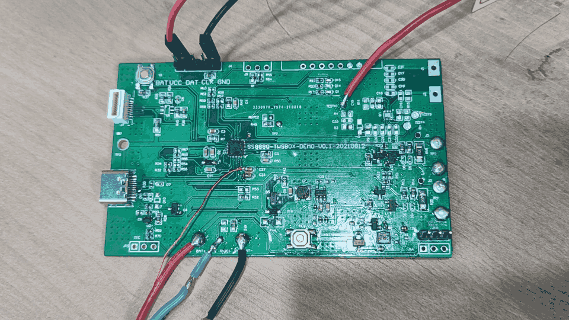

# 1. 功能说明
本例程于SS888X平台使用Data Flash模块实现对Data Flash的读写。UDB控制器实体选择Data Flash，先将数据写入到Data Flash，再从Data Flash读取数据，将写入数据与读取数据进行比较，正确则点亮LED灯。

# 2. 功能实现

初始化：

（1）配置UDBCON寄存器的UDBSEL选择Data Flash

（2）配置UDBCON寄存器的RWEN清0不使能读与写

读操作：

（1）配置UDBCON寄存器的RWEN读使能

（2）UDBADR寄存器写入目标地址

（3）UDBADR寄存器RD置位激活读周期

（4）等待硬件将UDBCON寄存器RD清0

（5）读取UDBDAT寄存器获取数据

（6）重复（2）~（5）将全部数据读取完

（7）配置UDBCON寄存器的RWEN清0不使能读与写

写操作：

（1）配置UDBCON寄存器的RWEN写使能

（2）UDBADR寄存器写入目标地址

（3）UDBDAT寄存器写入目标数据

（4）UDBADR寄存器WR置位激活写周期

（5）等待硬件将UDBCON寄存器WR清0

（6）重复（2）~（5）将全部数据写入完

（7）配置UDBCON寄存器的RWEN清0不使能读与写

（写操作需要VIN上有5V输入）

# 3. 代码编译

## 3.1 PlatformIO IDE

和其它例程基本一致，不再详细说明，具体参考：

###### [led-blink/doc/readme.md](../../../ss881x/led-blink/doc/readme.md)

### 3.1.1 参考如下链接，搭建PlatformIO IDE的开发环境

http://www.sinhmicro.com.cn/index.php/more/blog/vscode-platformio-sinh51

### 3.1.2 在PlatformIO IDE中打开工程并编译

和其它例程基本一致，不再详细说明，具体参考：

[led-blink/doc/readme.md](../../../ss881x/led-blink/doc/readme.md)

## 3.2 Keil C51 IDE

### 3.2.1 参考如下链接，搭建Keil C51 IDE的开发环境

http://www.sinhmicro.com/index.php/tool/software/debugger/sinh51_keil

### 3.2.2 在Keil C51 IDE中打开工程并编译

和其他例程基本一致，不在详细说明，具体参考：

[led-blink/doc/readme.md](../../../ss881x/led-blink/doc/readme.md)

# 4. 测试步骤

## 4.1 通过模拟器测试
### 4.1.1 PlatformIO IDE

暂不支持。

### 4.1.2 Keil C51 IDE

暂不支持。

## 4.2 通过开发板测试

### 4.2.1 参考如下链接，进行硬件连接

http://sinhmicro.com/index.php/tool/hardware/debugger/ssd8

（1）P10连接LED串联电阻上拉到VBAT

（2）VIN连接电源+5V，GND连接电源GND

### 4.2.2 通过Flash_Tools烧录固件

和其它示例基本一致，不再详细说明，具体请参考：

[led-blink/doc/readme.md](../../../ss881x/led-blink/doc/readme.md)

### 4.2.3 硬件调试

实际效果如图所示，供给5V电源时，先将数据写入到Data Flash，再从Data Flash读取数据，将写入数据与读取数据进行比较，比较正确则亮LED，LED亮说明对Data Flash的写入和读取正确。

