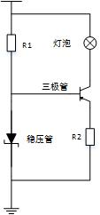
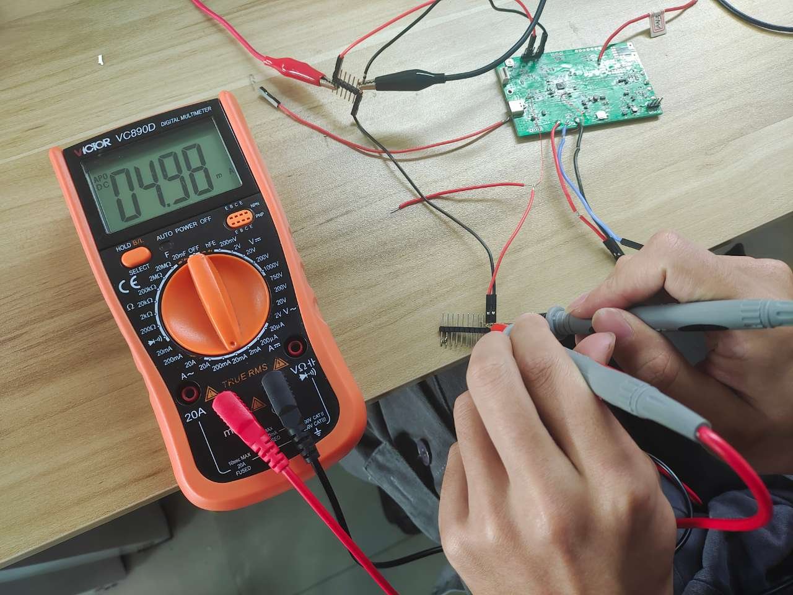
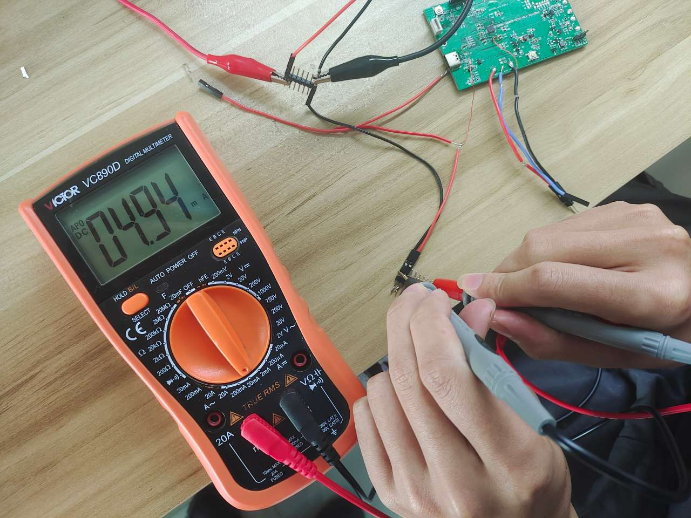

# 1. 功能说明

功能说明：控制P24口恒流输出6mA的电流，通过改变负载电阻的大小检测恒流输出的结果。

恒流驱动原理：

​                                                                     图  恒流驱动原理图

​        如图所示，通过稳压管限制三极管基极电压在一定值（假设为5V），若此时三极管导通，此时发射结的电压为4.3V，当R2阻值一定时可得到Ie 。此时加大集电极电流，对应的发射极电流也会增大，即R2两端电压增大，当其增加到4.3V时，三极管截止迫使R2两端电压又下降到三极管能导通的数值，如此循环，从而保证发射极电流在一定范围内波动，形成闭环负反馈，从而实现恒流驱动的功能。

# 2. 功能实现

1. 通过EFR寄存器配置使能LDOCON0中的BGEEN和IBIASEN。

2. 将P23口配置成输出模式。

3. 将P23口的输出模式选择为恒流输出且输出电流大小为6mA。

# 3. 代码编译

## 3.1 PlatformIO IDE

和其它例程基本一致，不再详细说明，具体参考：

###### [led-blink/doc/readme.md](../../../ss881x/led-blink/doc/readme.md)

### 3.1.1 参考如下链接，搭建PlatformIO IDE的开发环境

http://www.sinhmicro.com.cn/index.php/more/blog/vscode-platformio-sinh51

### 3.1.2 在PlatformIO IDE中打开工程并编译

和其它例程基本一致，不再详细说明，具体参考：

[led-blink/doc/readme.md](../../../ss881x/led-blink/doc/readme.md)

## 3.2 Keil C51 IDE

### 3.2.1 参考如下链接，搭建Keil C51 IDE的开发环境

http://www.sinhmicro.com/index.php/tool/software/debugger/sinh51_keil

### 3.2.2 在Keil C51 IDE中打开工程并编译

和其他例程基本一致，不在详细说明，具体参考：

[led-blink/doc/readme.md](../../../ss881x/led-blink/doc/readme.md)

# 4. 测试步骤

## 4.1 通过模拟器测试

### 4.1.1 PlatformIO IDE

暂不支持。

### 4.1.2 Keil C51 IDE

暂不支持。

## 4.2 通过开发板测试

### 4.2.1 参考如下链接，进行硬件连接

http://sinhmicro.com/index.php/tool/hardware/debugger/ssd8

### 4.2.2 通过Flash_Tools烧录固件

和其它示例基本一致，不再详细说明，具体请参考：

[led-blink/doc/readme.md](../../../ss881x/led-blink/doc/readme.md)

### 4.2.3 硬件调试

​      在P23口端分别串上阻值为10KΩ和20KΩ的电阻，通过万用表测量两种情况下电阻两端的电流，如图3图4所示，发现电流恒定在5mA左右，恒流输出配置成功。 

​                               

​               图1外接10KΩ时负载电流                                             图2 外接20KΩ时负载电流
