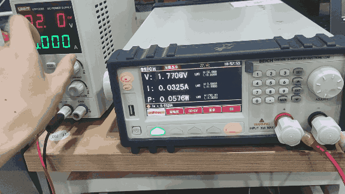
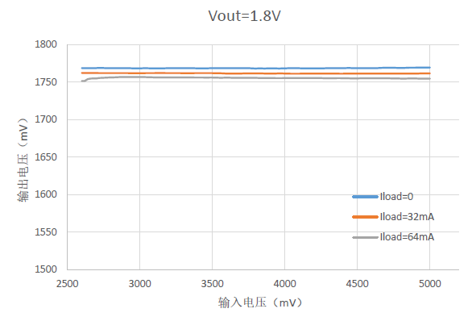
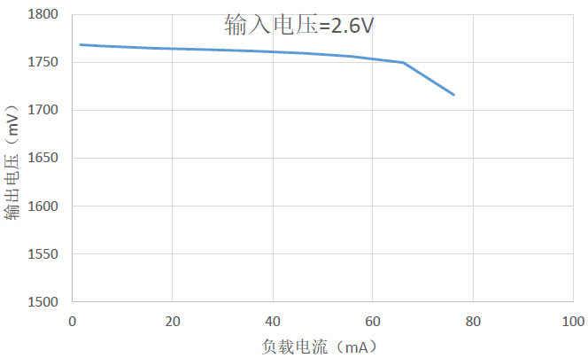

# 1. 功能说明
本例程于SS888X平台使用LDO模块，可通过配置寄存器控制4档电压输出。本例程配置LDO模块为正常模式，开启过流检测，当发生过流超过设定的阈值时，LED灯亮。

# 2. 功能实现

（1）配置LDOCON1寄存器OCMODE清0过流检测为正常模式（当过流时点亮LED）

（2）配置LDOCON0寄存器VSET设置输出电压、OCISET设置过流电流、OCEN使能过流保护、BGREN使能BGR基准

（3）配置LDOCON0寄存器EN位使能LDO

整体流程:

通过配置LDOCON0、LDOCON1寄存器控制LDO对应电压的输出，配置过流检测的阈值。当发生过流时，LDOCON1的OCSTAT位锁定为1，此时控制LED灯亮。（过流时LDO不工作，并且需要将LDO关闭再打开才能清除该位并且使LDO继续输出）

# 3. 代码编译

## 3.1 PlatformIO IDE

和其它例程基本一致，不再详细说明，具体参考：

###### [led-blink/doc/readme.md](../../../ss881x/led-blink/doc/readme.md)

### 3.1.1 参考如下链接，搭建PlatformIO IDE的开发环境

http://www.sinhmicro.com.cn/index.php/more/blog/vscode-platformio-sinh51

### 3.1.2 在PlatformIO IDE中打开工程并编译

和其它例程基本一致，不再详细说明，具体参考：

[led-blink/doc/readme.md](../../../ss881x/led-blink/doc/readme.md)

## 3.2 Keil C51 IDE

### 3.2.1 参考如下链接，搭建Keil C51 IDE的开发环境

http://www.sinhmicro.com/index.php/tool/software/debugger/sinh51_keil

### 3.2.2 在Keil C51 IDE中打开工程并编译

LDO输出电压、过流电流可根据宏定义提示进行设置

和其他例程基本一致，不在详细说明，具体参考：

[led-blink/doc/readme.md](../../../ss881x/led-blink/doc/readme.md)

# 4. 测试步骤

## 4.1 通过模拟器测试
### 4.1.1 PlatformIO IDE

暂不支持。

### 4.1.2 Keil C51 IDE

暂不支持。

## 4.2 通过开发板测试

### 4.2.1 参考如下链接，进行硬件连接

http://sinhmicro.com/index.php/tool/hardware/debugger/ssd8

（1）P10连接LED灯串联电阻上拉到VBAT

（2）MCU的VBAT和LDOIN引脚连接直流稳压电源+端，LDOOUT引脚连接电子负载仪+端，GND都共地

### 4.2.2 通过Flash_Tools烧录固件

和其它示例基本一致，不再详细说明，具体请参考：

[led-blink/doc/readme.md](../../../ss881x/led-blink/doc/readme.md)

### 4.2.3 硬件调试

输入输出特性：

代码配置LDO模块输出电压Vout1.8V，调节直流稳压电源2.6~5V范围，其输出电压在32mA负载下随输入电压变化如图所示。可以看到其基本符合数据手册的输入输出特性（Vout=2.5V、3.0V、3.3V和其他负载方法一致）

负载特性：

代码配置LDO模块输出电压Vout1.8V，设置直流稳压电源2.6V，调节负载仪的负载电流(0~100mA)，其输出电压在随着负载电流变化如图所示。当负载电流超过设定阈值时，发生过流保护，此时LDO不工作，MCU检测过流标志并控制LED灯亮。其总体基本符合数据手册的负载特性（Vin=3V、3.5V、3.8V方法一致）

