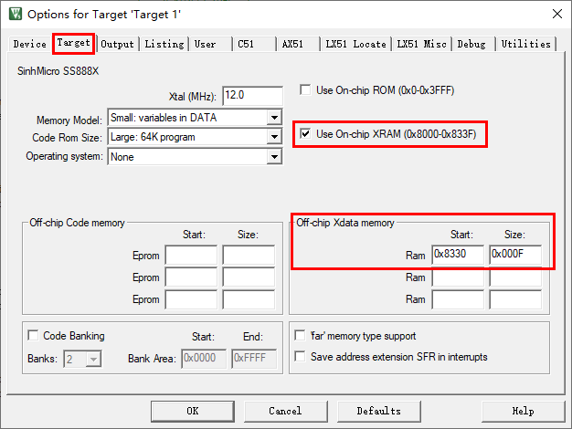

# 1. 功能说明

本例程于SS888X平台使用XData方式的读写实现sleep模式下对XDATA数据的保存。通过工程配置xdata最后16字节不使用，sleep前分别将数据储存于xdata的最后16字节中和通常的xdata中，sleep唤醒后分别将数据从xdata最后16字节中和通常的xdata区域（主要与最后16字节做对比）读取出来，与sleep前的写入数据进行比较。通常的xdata区域保存成功点亮LED2红灯，最后16字节保存成功则点亮LED1蓝灯。LED0绿灯则指示首次上电时未进入sleep模式。

# 2. 功能实现

判断sleep模式唤醒还是正常上电：

（1）进入sleep模式前对RESETS1寄存器的FON位进行清0

（2）DSEN置1进入sleep模式

（3）检测RESETS1寄存器的FON位。当sleep模式唤醒时该位保持0；正常上电该位则硬件置1

实现流程：（工程配置时，将XDATA最后16字节预留出来，不使用。）

（1）首先定义并初始化写入数组与读取均为不同值

（2）配置WDTCON关闭看门狗

（3）检测RESETS1寄存器的FON位-->（4）or（5）

（4）当正常上电则进行延迟2秒点亮LED0绿灯，分别写入数据到XData的高字节和低字节中，最后进入sleep模式

（5）当通过P04引脚SLPWK0从休眠模式唤醒复位时，读取XData数据到数组中

（6）判断读取与写入的数据来判断是否成功保持存储，LED1蓝灯亮指示在sleep模式时XData高字节数据的保持，LED2红色灯灭指示在sleep模式时XData低字节数据的丢失

XData高字节sleep下的保持应为UDB方式的的读取，UDB的操作的实现，具体参考：

###### [data-flash-test/doc/readme.md](../../data-flash-test/doc/readme.md)（UDB控制器实体选择XDATA）

# 3. 代码编译

## 3.1 PlatformIO IDE

和其它例程基本一致，不再详细说明，具体参考：

###### [led-blink/doc/readme.md](../../../ss881x/led-blink/doc/readme.md)

### 3.1.1 参考如下链接，搭建PlatformIO IDE的开发环境

http://www.sinhmicro.com.cn/index.php/more/blog/vscode-platformio-sinh51

### 3.1.2 在PlatformIO IDE中打开工程并编译

和其它例程基本一致，不再详细说明，具体参考：

[led-blink/doc/readme.md](../../../ss881x/led-blink/doc/readme.md)

## 3.2 Keil C51 IDE

### 3.2.1 参考如下链接，搭建Keil C51 IDE的开发环境

http://www.sinhmicro.com/index.php/tool/software/debugger/sinh51_keil

### 3.2.2 在Keil C51 IDE中打开工程并编译

工程配置时，将XDATA最后16字节（可自定义最大128字节）预留出来不使用；并且勾选使用片上XRAM（主要与最后16字节做对比）

和其他例程基本一致，不在详细说明，具体参考：

[led-blink/doc/readme.md](../../../ss881x/led-blink/doc/readme.md)

# 4. 测试步骤

## 4.1 通过模拟器测试

### 4.1.1 PlatformIO IDE

暂不支持。

### 4.1.2 Keil C51 IDE

暂不支持。

## 4.2 通过开发板测试

### 4.2.1 参考如下链接，进行硬件连接

http://sinhmicro.com/index.php/tool/hardware/debugger/ssd8

### 4.2.2 通过Flash_Tools烧录固件

和其它示例基本一致，不再详细说明，具体请参考：

[led-blink/doc/readme.md](../../../ss881x/led-blink/doc/readme.md)

### 4.2.3 硬件调试

（1）P07连接LED0（绿灯）串联电阻上拉到VBAT、P10连接LED1（蓝灯）串联电阻上拉到VBAT、P15连接LED2（红灯）串联电阻上拉到VBAT

（2）P04（SLPWK0）连接按钮串联上拉电阻到VBAT

（3）VBAT连接电池+端，GND连接电池-端（VIN接入会触发唤醒不进行连接）

实际效果如图所示，当VBAT接入电池时，LED0绿灯亮2秒，分别写入数据到XDATA高字节和正常使用范围中，然后进入sleep模式，此时LED0绿灯因为进入sleep模式而熄灭。当按下按钮使P04（SLPWK0）高电平时，从sleep模式唤醒，判断sleep模式唤醒还是正常上电，当sleep模式唤醒进行读取数据（正常上电则LED0绿灯和写入数据操作），对读取数据与先前的写入数据进行比较正确，XDATA高字节保存成功则点亮LED1（蓝灯），XDATA通常范围保存成功则点亮LED2（红灯），LED1（蓝灯）亮说明sleep模式下正确对XDATA的高字节写入数据的保持存储，LED2（红灯）灭说明sleep模式下无法对XDATA的通常范围写入数据的保持存储。
