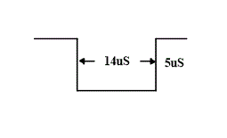
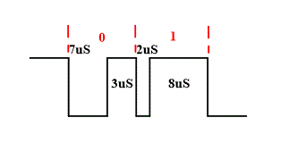
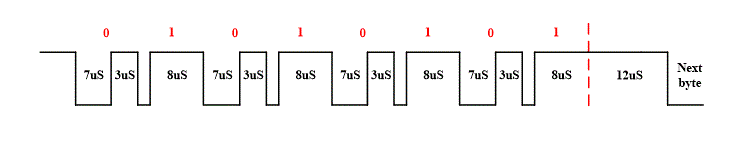
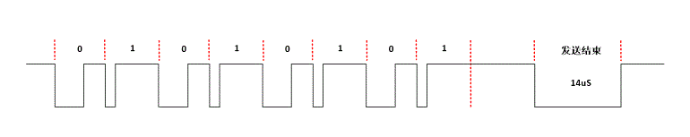
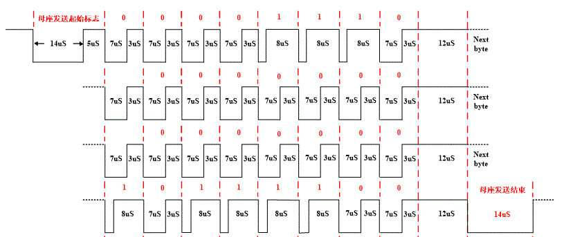

# 1. 功能说明
可使用ss888x的超级串行协议（SSP）接口适配你想要的特殊协议。超级串行协议(SSP)接口，可适配多种通信协议（通信方式为串行半双工），支持PWM、差分双相两种编码格式。是一个高灵活、兼容性的通讯端口。

现演示实现一个好玩的特殊协议。

# 2. 实现步骤

1. 协议说明如下。

   1）数据格式编码：

   **发送指令时的起始信号：**每次发送指令时，第一个Byte前会有一个起始位，如图：

   

   **bit格式：**每个bit发送开始时Data拉低，每个bit持续时间为10uS，通过每个bit的低电平持续时间区分0、1，这里以7uS低电平3uS高电平为0，以2uS低电平8uS高电平为1,如图：

   

   **一个Byte发送结束标志：**一条指令有多个byte，每个byte的停止信号为高电平持续12uS，如图：

   

   **发送指令结束标志：**发送完该指令的几个byte后，再拉低14uS作为结束标志，如图：

   

   2）一个完整的通信，如图：

   

2. 根据此协议要求，配置超级串行协议（SSP）接口。

   可以看出整个通信过程起始信号、数据包和终止信号是不同的时序要求，所以需要在相应的阶段配置SSP模块相关的寄存器以满足相应的时序要求。**需要特别注意的是：一定要在FIFO未空时，改变SSP相关配置，这样才能满足不同时序的数据信号无缝衔接上。**

3. 将要发送的数据写入寄存器SSPDAT。

   写该寄存器时，硬件会将TX DATA和TX 配置信息写进FIFO，并启动一次TX传输。

   （注意：发送FIFO有两层，写寄存器SSPDAT前，应该先判断FIFO是否已满。）

# 3. 代码编译

## 3.1 PlatformIO IDE

### 3.1.1 参考如下链接，搭建PlatformIO IDE的开发环境

http://www.sinhmicro.com.cn/index.php/more/blog/vscode-platformio-sinh51

### 3.1.2 在PlatformIO IDE中打开工程并编译

和其它示例基本一致，不再详细说明，具体请参考：

[led-blink/doc/readme.md](../../led-blink/doc/readme.md)

## 3.2 Keil C51 IDE

### 3.2.1 参考如下链接，搭建Keil C51 IDE的开发环境

http://www.sinhmicro.com/index.php/tool/software/debugger/sinh51_keil

### 3.2.2 在Keil C51 IDE中打开工程并编译

和其它示例基本一致，不再详细说明，具体请参考：

[led-blink/doc/readme.md](../../led-blink/doc/readme.md)

# 4. 测试步骤

## 4.1 通过模拟器测试
### 4.1.1 PlatformIO IDE

暂不支持。

### 4.1.2 Keil C51 IDE
暂不支持。

## 4.2 通过开发板测试

### 4.2.1 参考如下链接，进行硬件连接

http://sinhmicro.com/index.php/tool/hardware/debugger/ssd8

### 4.2.2 通过Flash_Tools烧录固件

和其它示例基本一致，不再详细说明，具体请参考：

[led-blink/doc/readme.md](../../led-blink/doc/readme.md)

### 4.2.3 通过硬件调试查看效果

这里不再演示，可自行使用示波器抓波调试。
