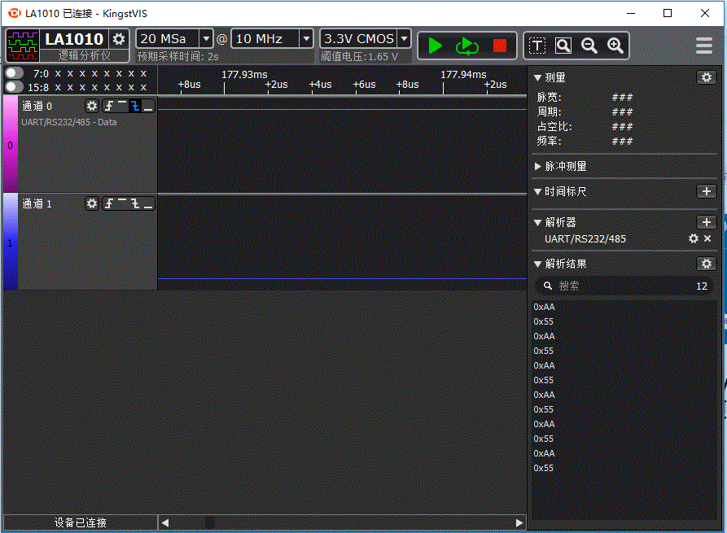

# 1. 功能说明
使用ss888x的超级串行协议（SSP）接口适配UART通信协议，实现数据发送。超级串行协议(SSP)接口，可适配多种通信协议（通信方式为串行半双工），支持PWM、差分双相两种编码格式。是一个高灵活、兼容性的通讯端口。

# 2. 实现步骤

1. 熟知UART通信协议。

   1）UART协议规定，总线处于空闲状态时信号线的状态为‘1’即高电平。

   2）开始通信时发送方先发出一个逻辑”0”的信号（低电平），表示传输字符的开始。

   3）数据位可以是5、6、7、8，9位等，先发送**最低位**，最后发送**最高位**。

   4）检验方式使用奇偶校验，可有可无。

   5）停止位可以是1、1.5、2位的高电平。

2. 根据UART协议，初始化超级串行协议（SSP）接口。

   1）通过寄存器SSPCON0使能START信号和STOP信号，使用PWM位编码，SSP CLOCK的时间Tclock = 1us（即串口波特率为1MHz），时钟分频系数为12。

   2）通过寄存器SSPCON1设置空闲状态下默认拉高，SSP工作在TX模式，发送数据位数8位。

   3）设置START时序为低电平持续1us时间（空闲状态下被拉低1us时间为START信号。）；

   ​      设置ZERO时序为低电平持续1us时间；

   ​      设置ONE时序为高电平持续1us时间；

   ​      设置STOP时序为高电平持续1us时间（发完8位数据位后被拉高1us为STOP信号。）。

3. 将要发送的数据写入寄存器SSPDAT。

   写该寄存器时，硬件会将TX DATA和TX 配置信息写进FIFO，并启动一次TX传输。

   （注意：发送FIFO有两层，写寄存器SSPDAT前，应该先判断FIFO是否已满。）

# 3. 代码编译

## 3.1 PlatformIO IDE

### 3.1.1 参考如下链接，搭建PlatformIO IDE的开发环境

http://www.sinhmicro.com.cn/index.php/more/blog/vscode-platformio-sinh51

### 3.1.2 在PlatformIO IDE中打开工程并编译

和其它示例基本一致，不再详细说明，具体请参考：

[led-blink/doc/readme.md](../../led-blink/doc/readme.md)

## 3.2 Keil C51 IDE

### 3.2.1 参考如下链接，搭建Keil C51 IDE的开发环境

http://www.sinhmicro.com/index.php/tool/software/debugger/sinh51_keil

### 3.2.2 在Keil C51 IDE中打开工程并编译

和其它示例基本一致，不再详细说明，具体请参考：

[led-blink/doc/readme.md](../../led-blink/doc/readme.md)

# 4. 测试步骤

## 4.1 通过模拟器测试
### 4.1.1 PlatformIO IDE

暂不支持。

### 4.1.2 Keil C51 IDE
暂不支持。

## 4.2 通过开发板测试

### 4.2.1 参考如下链接，进行硬件连接

http://sinhmicro.com/index.php/tool/hardware/debugger/ssd8

### 4.2.2 通过Flash_Tools烧录固件

和其它示例基本一致，不再详细说明，具体请参考：

[led-blink/doc/readme.md](../../led-blink/doc/readme.md)

### 4.2.3 通过硬件调试查看效果

（发送数据为0xAA，数据从低位开始发送。）
