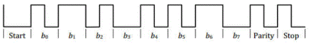

# 1. 功能说明
使用ss888x的超级串行协议（SSP）接口适配QI无线充通信协议，实现RX端发送身份识别包信号和配置包信号。超级串行协议(SSP)接口，可适配多种通信协议（通信方式为串行半双工），支持PWM、差分双相两种编码格式。是一个高灵活、兼容性的通讯端口。

# 2. 实现步骤

1. 熟知无线充电通讯协议。

   1）QI通信数据格式编码：

   数据编码格式为：起始位0、8 位数据位、一个奇偶校验位（使用奇校验）和一个停止位1组成。以值0x35为例：

   

   每一位的传输时间为500us。

   数据 0：500us的高电平，或者500us的低电平。
   数据 1：250us高电平+250us低电平，或者250us低电平+250us高电平。

   2）数据包结构：前导码（11~25位连续1）、包头（1byte）、数据信息（1~27byte）和校验和（1byte）四部分组成。

   

   前导码：为11~25位连续1，使功率发射器同步输入数据并准确检测报头的起始位。

   包头：表示包类型，发包顺序是0X01（信号强度包），0X71（身份标识包）,0X51（配置包），包中间间隔小于21ms。

   校验：为包头和数据信息异或。

2. 根据无线充电通讯协议，初始化超级串行协议（SSP）接口。

   1）通过寄存器SSPCON0使能PARITY信号（采用奇校验）、START信号和STOP信号，使用差分双向位编码，位元（bit）的位宽时间Tclock = 500us（即时钟信号的频率为2KHz），时钟分频系数为6000。

   2）设置START信号极性为0；

   ​      设置ZERO和ONE信号的编码方式为：ZERO为高或低电平信号，ONE为沿跳变信号；

   ​      设置STOP信号极性为1。

3. 将要发送的包数据逐个写入寄存器SSPDAT。

   一个完整的包应包括前导码（11~25位连续1）、包头（1byte）、数据信息（1~27byte）和校验和（1byte）四部分组成。

   校验和为包头和数据信息异或的结果。
   
   写该寄存器时，硬件会将TX DATA和TX 配置信息写进FIFO，并启动一次TX传输。
   
   （注意：发送FIFO有两层，写寄存器SSPDAT前，应该先判断FIFO是否已满。）
   
   

# 3. 代码编译

## 3.1 PlatformIO IDE

### 3.1.1 参考如下链接，搭建PlatformIO IDE的开发环境

http://www.sinhmicro.com.cn/index.php/more/blog/vscode-platformio-sinh51

### 3.1.2 在PlatformIO IDE中打开工程并编译

和其它示例基本一致，不再详细说明，具体请参考：

[led-blink/doc/readme.md](../../led-blink/doc/readme.md)

## 3.2 Keil C51 IDE

### 3.2.1 参考如下链接，搭建Keil C51 IDE的开发环境

http://www.sinhmicro.com/index.php/tool/software/debugger/sinh51_keil

### 3.2.2 在Keil C51 IDE中打开工程并编译

和其它示例基本一致，不再详细说明，具体请参考：

[led-blink/doc/readme.md](../../led-blink/doc/readme.md)

# 4. 测试步骤

## 4.1 通过模拟器测试
### 4.1.1 PlatformIO IDE

暂不支持。

### 4.1.2 Keil C51 IDE
暂不支持。

## 4.2 通过开发板测试

### 4.2.1 参考如下链接，进行硬件连接

http://sinhmicro.com/index.php/tool/hardware/debugger/ssd8

### 4.2.2 通过Flash_Tools烧录固件

和其它示例基本一致，不再详细说明，具体请参考：

[led-blink/doc/readme.md](../../led-blink/doc/readme.md)

### 4.2.3 通过硬件调试查看效果

这里不再演示，可自行使用示波器抓波验证。
